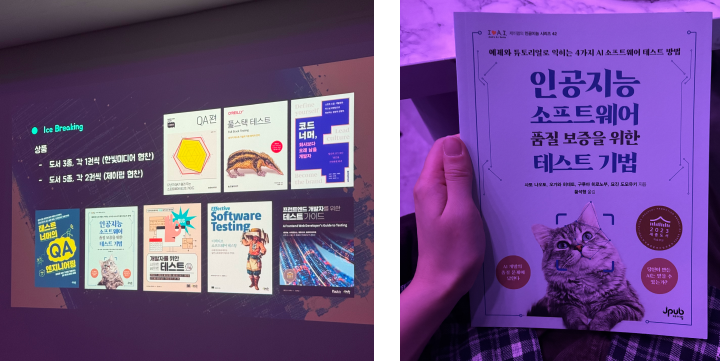
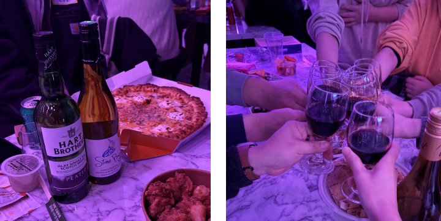
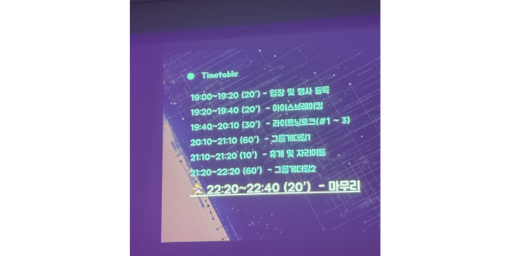

11월에 OFF QA 를 다녀왔습니다. 요즘 갖고 있는 고민을 털어놓고 싶었고, 한 제품을 깊게 파고드는 QA는 어떤 느낌인지 궁금해서 신청했습니다.

참가비랑 밥값까지 하면 5만원이라 솔직히 싸진 않았는데… 다녀오고 나서는 아깝다는 생각이 전혀 안 들었습니다! 오히려 다음 행사도 참여하고 싶을 정도입니다.

아이스 브레이킹으로 QA 용어 맞추기 퀴즈를 했습니다. 저도 퀴즈를 맞추고 어떤 책을 고를지 한참 고민했습니다. LLM QA는 어떻게 접근하는지 궁금해져서 『인공지능 소프트웨어 품질 보증을 위한 테스트 기법』을 선택했습니다. (여담으로 메타모픽 테스트를 활용한다고 합니다.)

드디어 네트워킹이 본격적으로 시작됐습니다. 여러 도메인 얘기를 들었는데, 낯선 분야라 완전히 이해하긴 어려웠습니다. 가장 흥미로웠던 분야는 커머스였습니다. 커피챗 했던 분들도 커머스 QA가 가장 재밌다고 해서 왜 그런지 물어봤습니다. 커머스는 정책이 자주 바뀌는데, 그 변화에 맞춰 QA 하는게 가장 재밌다고 했습니다. 이야기를 들어보니 QA가 매출과 바로 맞닿아 있는 점도 흥미로웠습니다.

이후에는 어떻게 해야 QA 역할을 더 잘할 수 있을지 고민을 털어놨습니다. 미래에 100% 발생할 리스크들을 어떻게 다뤄야할지가 큰 고민이었는데, 리스크를 완전히 막으려 하지 말고 수치를 얼마나 완화할 수 있는지를 얘기하라고 한게 가장 인상이 깊었습니다. 또 개인적인 고민을 몇가지 털어놨는데, 자연스러운 현상이라고 하셔서 큰 도움이 됐습니다.

OFF QA 덕분에 제 업무를 기술적으로 해결할 수 있는 부분이 무엇인지 고민할 수 있는 동기부여도 되고, 도움되는 조언을 들을 수 있어 좋았습니다. 훗날에는 제가 고민을 들어주는 사람이 되기를… 아자아자!
