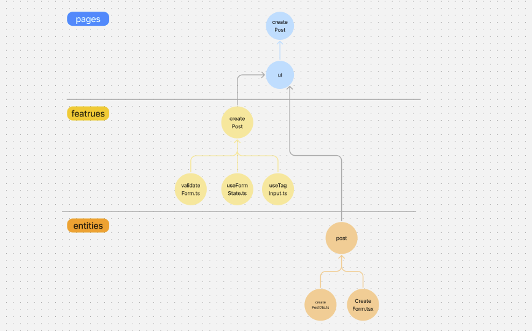
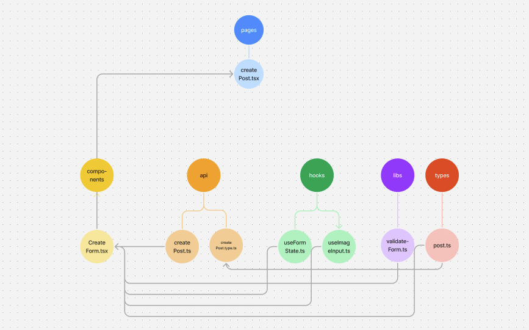

## 들어가며

이번 프로젝트에서 코드의 유지보수성과 확장성을 높일 수 있는 FSD 아키텍처를 도입했습니다. 그 중 `createPost` 기능을 구현하며 기존 방식에서 느꼈던 문제점들과 FSD를 적용한 후 느낀 점을 회고해보려고 합니다.

### FSD란?

FSD는 `Feature-Sliced Design`로 코드를 **목적**에 따라 애플리케이션 구조를 잡는 아키텍처 방법론입니다. 이를 통해 **코드의 응집도를 높이고 결합도를 낮추어** 프로젝트 유지보수성을 극대화하는 데 중점을 둡니다.

**FSD의 주요 개념**


- **레이어**: 애플리케이션의 전반적인 구조를 7가지 계층(App, Pages, Features 등)으로 나눔.
- **슬라이스**: 각 비즈니스 도메인에 맞게 코드를 분리.
- **세그먼트**: 슬라이스와 레이어 내에서 목적별로 코드를 분리 (예: UI, API, Model).

FSD의 import 규칙은 **상위 레이어가 하위 레이어를 참조 가능**하다는 점과 **슬라이스는 Public API를 가진다**는 점이 핵심입니다.

## FSD 구조를 적용한 createPost

FSD를 적용하여 `createPost` 기능을 다음과 같이 구조화했습니다.

### FSD 구조 적용

- `pages/createPost/ui`: 페이지의 UI 구성.
- `features/createPost/lib`: 폼 유효성 검사 로직.
- `features/createPost/model`: 상태 관리 및 데이터 모델 정의.
- ...

```plaintext
.
├── entities
│   └── post
│       ├── api
│       │   ├── createPostDto.ts
│       │   └── createPost.ts
│       └── ui
│           └── createForm.tsx
├── features
│   └── createPost
│       ├── lib
│       │   └── validateForm.ts
│       └── model
│           ├── tag.ts
│           ├── useFormState.ts
│           └── useTagInput.ts
└── pages
    └── createPost
        └── ui
```

### 기존 스타일과 비교

FSD를 적용하기 전에는 코드 타입별로 폴더를 분류했습니다. 기존 방식으로 createPost 기능을 재구성하면 다음과 같은 모습입니다

```
.
├── api
│   └── createPost
│       ├── index.ts
│       └── type.ts
├── components
│   ├── common
│   └── createPost
│       └── CreateForm.tsx
├── pages
│   └── createPost.tsx
├── hooks
│   ├── useFormState.ts
│   └── useImageInput.ts
├── libs
│   └── validateForm.ts
└── types
    └── post.ts
```

이 방식은 간단해 보이지만, 다음과 같은 문제점이 있었습니다:

- 타입 관리의 혼란: 특정 타입이 여러 곳에서 사용되더라도, 어디서 관리해야 하는지 모호함.
- 응집도 부족: 관련 코드가 분산되어, 하나의 기능을 수정하려면 여러 폴더를 오가야 했음.

FSD 적용 전후의 import 관계를 대략적으로 그려보았습니다.

FSD 적용 후: 기능병로 코드가 모여 있어 의존 관계가 단순해짐


FSD 미적용: 코드가 분산되어 있어 의존 관계가 복잡함


## 정리

FSD는 러닝 커브가 높지만, 다음과 같은 이점을 제공합니다:

1. **유지보수성 향상**: 도메인별로 코드가 나뉘어 기능 수정이 용이.
2. **응집도 증가**: 관련 코드가 한곳에 모여 있어 가독성과 확장성이 개선.
3. **결합도 감소**: 코드 간 의존성이 줄어 변경 사항의 영향을 최소화.

---

참조:

- https://feature-sliced.design/docs
- https://velog.io/@teo/fsd
