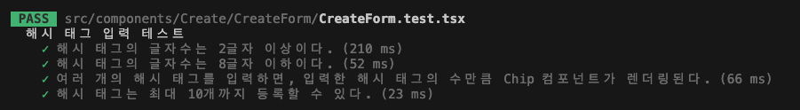

import hashtagGif from './해시태그입력.gif';

프로젝트에서 한글 입력 시 마지막 글자가 지워지지 않는 IME 버그를 겪었습니다. “유닛 테스트에서 잡을 수 있었다면 좋았을 텐데…” 싶어 앞으로는 TDD도 해보자는 마음으로 Jest로 폼 테스트를 학습해봤습니다.
그런데 예상과 달리 Jest에선 이 문제가 드러나지 않고 테스트가 성공했습니다.

이번 글은 그 과정에서 배운 Jest 디바운스 테스트와 API 모킹 경험, 그리고 브라우저 환경에서의 E2E 테스트가 필요한 이유를 정리한 글입니다.

## 테스트할 기능

테스트할 기능은 입력 후 API 호출로 메타데이터를 불러오는 기능입니다.


1. 사용자가 링크를 입력한다.
2. 해당 링크로 API 요청을 보내 메타데이터를 가져온다.
3. 결과를 화면에 표시한다.

여기서 입력이 변경될 때마다 불필요한 API 요청이 발생하지 않도록 `2000ms` 디바운스를 적용했습니다.

### 디바운스 모방하기

```jsx
const urlInput = screen.getByLabelText('링크');

fireEvent.change(urlInput, { target: { value: 'https://www.naver.com/' } });
await act(async () => {
  jest.advanceTimersByTime(2000); // 디바운스 적용
});
```

- `jest.advanceTimersByTime(ms)` : 지정한 ms만큼 시간이 흐른 것처럼 시뮬레이션

테스트 후에는 타이머를 초기화해줍니다.

```jsx
afterEach(() => {
  jest.clearAllTimers();
  jest.useRealTimers();
});
```

### API 요청 mocking하기

실제 API 호출을 막기 위해 msw로 응답을 모킹했습니다.

```jsx
const handlers = [
  rest.get(`${API_BASE_URL}/link/metadata`, (req, res, ctx) => {
    return res(
      ctx.status(200),
      ctx.json({
        metaDescription: '링크 설명',
        metaThumbnail: '링크 썸네일',
        metaTitle: '링크 타이틀',
        titleText: '타이틀 텍스트',
      })
    );
  }),
];
```

### 해시태그 입력 테스트하기

엔터 키 입력 시 해시태그가 추가되도록 구현했습니다. 아래 이미지처럼 현재 한글로 해시태그를 입력하는 경우에는 마지막 글자인 ‘녕’이 input에 남아있는 문제가 있습니다.


문제 시나리오에 대해서 테스트 코드를 작성했습니다.

```jsx
describe('해시 태그 입력 테스트', () => {
  test ('여러 개의 해시 태그를 입력하면, 입력한 해시 태그의 수만큼 Chip 컴포넌트가 렌더링된다.',
  // 해시태그 추가
  fireEvent.change(tagInput, { target: { value: '안녕' } });
  fireEvent.keyDown(tagInput, { key: 'Enter' });
  // input value가 빈값이어야 함
  expect(tagInput.value).toBe(''):


  // 연달아 새로운 해시태그 추가
  fireEvent.change(tagInput, { target: { value: '하이' } });
  fireEvent.keyDown(tagInput, { key: 'Enter' });
  // input value가 빈값이어야 함
  expect (tagInput.value).toBe('');
  // ...
```

하지만 테스트 결과는 실패하지 않고, 성공하고 말았습니다... 

## Jest에서는 왜 성공할까?

한글이 input에 여전히 남는 원인은 IME 입니다. `ㅇ ㅑ ㅎ ㅗ` 를 순서대로 입력하면 자음과 모음을 조합해 `야호` 를 출력합니다. 브라우저에서는 이 조합 과정을 `compositionstart`, `compositionend`같은 이벤트가 발생합니다. 하지만, Jest는 `야호’라는 value의 값을 넣었을 때, 이미 조합이 완료된 값을 넣으므로 마지막 글자가 남지 않아 해당 버그는 재현되지 않습니다.

## 브라우저 E2E 테스트 필요성

Jest만으론 브라우저가 가진 특징을 재현하기 어려운걸 깨달았습니다. 이를 보완할 수 있는 Cypress나 Playwright와 같은 E2E 도구의 필요성을 느꼈습니다.

---

참고

- [https://ko.wikipedia.org/wiki/입력기](https://ko.wikipedia.org/wiki/%EC%9E%85%EB%A0%A5%EA%B8%B0)
- [https://developer.mozilla.org/en-US/docs/Web/API/Element/compositionstart_event](https://developer.mozilla.org/en-US/docs/Web/API/Element/compositionstart_event)
- [https://ui.toast.com/posts/ko_20220624](https://ui.toast.com/posts/ko_20220624)
- [https://minjung-jeon.github.io/IME-keyCode-229-issue/](https://minjung-jeon.github.io/IME-keyCode-229-issue/)
