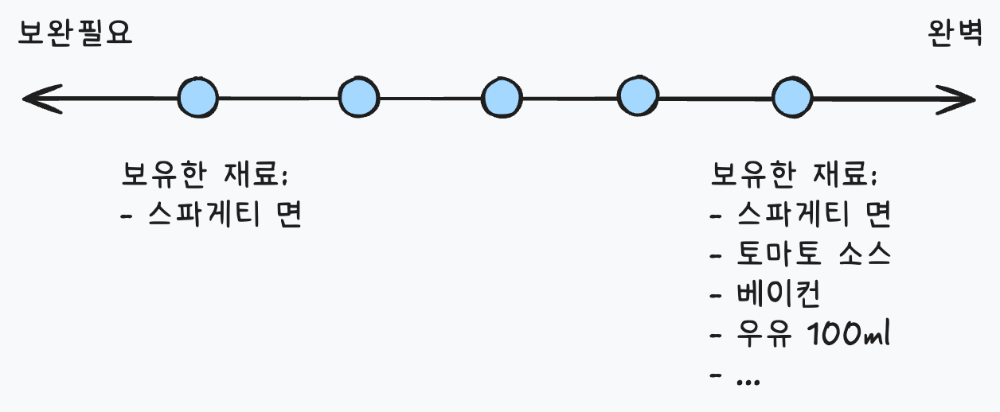

## LLM 챗봇 QA의 어려움

LLM은 입력값을 기반으로 가장 적절한 단어(토큰)을 출력하는 모델로, 동일한 입력이라도 매번 같은 출력을 보장하지 않습니다. 그래서 기존 QA 방식으로는 품질을 검증하기 어렵습니다.

이번 글에서는 챗봇 QA를 진행한 경험을 정리해 보겠습니다. 프로젝트를 간단히 소개하자면 챗봇과 5~7턴의 대화 후 사용자의 상태가 어떤지 진단하고 액션 아이템을 제안해주는 서비스입니다.

## 테스트 설계하기

### 페르소나 준비하기

진단 정확도를 평가하기 위해 다양한 페르소나가 필요했습니다. 보완이 필요한 상태부터 완벽에 가까운 상태까지 스펙트럼을 커버하는 페르소나를 AI의 도움을 받아 5개 생성했습니다.

토마토 스파게티 예시로 설명합니다. 재료가 부족할수록 '보완 필요' 페르소나에 해당합니다.

각 페르소나마다 "이 사람은 이런 상태, 이런 액션 아이템이 나와야 한다"로 미리 기대 결과를 정답지로 정의한 후, 실제 챗봇 결과와 대조했습니다.

### 골든 샘플 설정

LLM 특성상 같은 페르소나로 대화해도 매번 대화 흐름이 달라질 수 있습니다. 결과 비교를 용이하게 하기 위해, 각 페르소나의 첫 번째 대화 로그를 "골든 샘플"로 지정했습니다. 이후 실행 시 골든 샘플과 유사한 흐름으로 답변하도록 프롬프트를 조정했습니다. 그 결과, 긴 대화가 아닌 진단 결과만 비교할 수 있었습니다.

## 테스트 실행하기

하나의 페르소나로 5~7턴의 대화를 한다면 약 20분 정도 소요됩니다. 일관성 검증을 위해 페르소나당 3회씩 실행하는 기준을 세웠고, 총 15번 대화가 필요했습니다. 그래서 [agent-browser](https://agent-browser.dev/)를 활용하여 에이전트가 자동으로 웹에서 대화를 하도록 테스트를 실행했습니다.

## 응답 평가하기

대화 로그 채점은 LLM-as-a-Judge를 활용했습니다. 팀 내에서 합의한 Criteria를 기준으로, 진단 결과가 체크리스트 항목을 충족하는지 판정했습니다.

해당 접근법은 평가에 LLM을 이용하기 때문에 동일 입력에도 다른 점수로 평가하는 한계가 있습니다. 다만 테스트 오라클을 정의할 수 있어 비교적 평가 편차에 자유로울 수 있었습니다.

## 마치며

LLM 특성상 일관된 답변을 보장하기 어려웠는데, 골든 샘플로 대화 흐름을 고정하고 진단 결과만 비교하는 방식으로 범위를 좁히니 컨트롤할 수 있었습니다. LLM의 특성과 Criteria를 명확히 정의하면 충분히 활용 가능한 방법이란 것을 알게 됐습니다.
