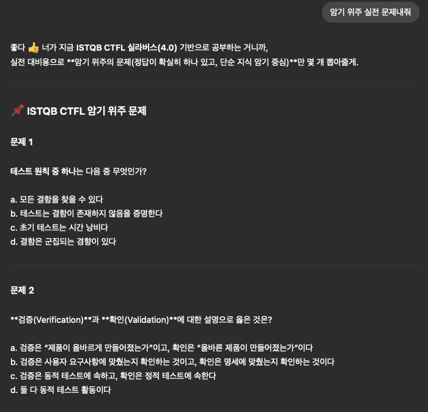
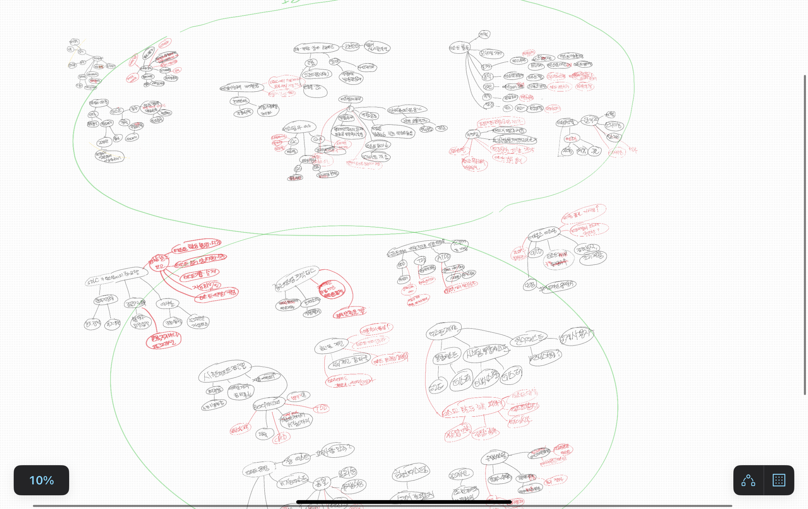

QA 관련 전문 지식을 쌓기 위해 ISTQB 자격증에 도전했습니다. 다른 후기를 보면 '실라버스만 공부하면 합격 가능하다'라고 했지만, 오픈 채팅에서는 2회 이상 응시했다는 후기가 있어 응시료가 20만 원이나 되는 만큼 부담감이 컸습니다. 그래도 다행히 합격해서 이렇게 후기를 남깁니다.

## 왜 ISTQB를 따려 했나?

직무전환의 진지함 보여주려고 했습니다. 20만원 상당의 자격증 & 국제 공인 자격증이여서 이 결심을 보여줄 수 있다고 생각했습니다.

그리고 현재 QA 직무로 근무하고 있는데, 얕은 지식만으로 시작하다 보니 모르는 게 많았습니다. 그래서 자격증 준비를 하면 기초 지식을 빠르게 다지는 방법이라고 생각했습니다. 자격증을 못따도 공부를 했으니 이득이라고 생각했습니다.

## 준비 방법

여러 후기를 봤는데 《개발자도 알아야 할 소프트웨어 테스팅 실무》(개.알 책) 실라버스를 추천했습니다.

저도 따라서 개.알을 구매했는데, 'SW 테스트가 이런 거구나' 정도만 감을 잡고 본격적인 공부는 실라버스로 진행했습니다.

저는 이렇게 공부했습니다.

1. 실라버스 1회독
2. GPT에 실라버스 pdf 첨부해서 문제 돌리기
3. 암기한 개념 써보기
4. 샘플 문제 풀기

이 4가지를 3번 반복했고 매일 2-3시간 두 달 정도 공부했습니다.

GPT랑 공부한 흔적

시험에서는 결함과 장애 같은 용어 차이를 정확히 아는지가 자주 나옵니다. 그래서 각 장마다 주요 개념을 마인드맵으로 정리하고 스스로 채점하는 방식이 큰 도움이 됐습니다.

## 시험 난이도 후기

실라버스 다독 + 샘플 문제를 무난히 풀 수 있다면 합격할 수 있습니다. 합격점을 위한 문제 정도라면 답이 바로 눈에 들어왔어요.

그러나 고득점을 노린다면... 4장은 추가 학습이 필요하다고 느꼈습니다. 샘플 문제만으로는 다양한 상황에 기법을 응용하기 어렵습니다. 샘플문제를 무난히 풀 수 있는 정도가 와서 자신이 있었는데 실제로는 어떤걸 찍어야할지 고민을 많이 했습니다.

## 후기

다행히 합격해 20만원을 지켜냈습니다! 점수는 아쉽게 간당간당했지만요

전 왜 이걸 해야 하는지 알아야 몰입이 잘 되는데, 자격증 공부하면서 확실히 그 부분이 채워졌습니다. 업무 지시를 이해하기도 쉬웠고, 더 나아가서 어떤걸 더 하면 좋을까? 하고 고민해볼 수 있더라구요.

자격증을 딸까 말까 고민 중이라면, 저는 따시는 추천합니다! :+1:
