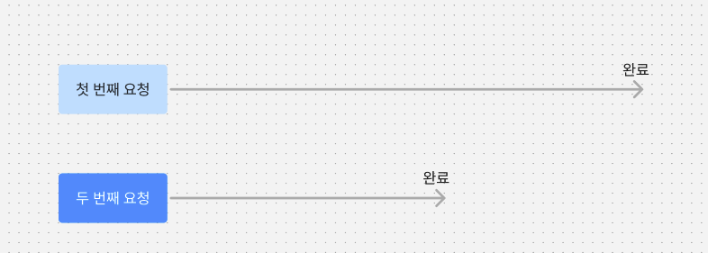

## 들어가며

React Query는 제가 애정하는 라이브러리 중 하나입니다. 데이터 패칭 상태 관리를 마법 처럼 우아하게 처리하고 캐싱을 통해 불필요한 네트워크 요청을 줄여 리소스를 절약할 수도 있습니다. 예전에는 `useEffect`로 구현했는데 반복되는 중복 코드때문에 고민이 많았던 기억이 납니다.

그런데 React Query에 너무 익숙해진 나머지, 정작 `useEffect`로 데이터 패칭을 구현하는 방법을 잊어버렸습니다. 그래서 이번에는 `useQuery` 훅을 직접 구현해보며 학습한 과정을 정리해보겠습니다.

## 구현 목표

이렇게 4가지를 구현해보았습니다.

1. 상태 관리: `isPending`, `isError`, `data` 상태를 관리
2. 경쟁 상태 방지: 여러번의 요청이 발생해도 최신 데이터만 화면에 보여지도록 보장
3. 캐싱: 캐싱된 데이터가 있으면 이를 우선적으로 보여주고, 데이터가 stale한 상태라면 새로운 데이터를 패치
4. retry 지원: 네트워크 요청 실패 시, 지정된 횟수만큼 재시도 할 수 있음

## 구현 과정

### 1. 상태 관리

`useEffect`를 사용해 `isPending`, `isError`, `data` 상태를 관리하는 기능을 구현하면서 무한 렌더링에 빠졌습니다.

`useEffect` 로직 내부에서 `queryKey`와 `queryFn`을 참조하여 `react-hooks` 린터 규칙에 따라 의존성 배열에 두 변수를 포함해야 합니다. 하지만 `queryFn`을 포함하면 무한 렌더링이 발생합니다.

이는 `queryFn`이 리렌더링이 될때마다 **새로운 객체로 평가**되기 때문에 무한 렌더링에 빠지게 됩니다. 그래서 이를 방지하기 위해 의존성 배열에 `queryKey`만 포함했습니다.

```tsx
// useQuery.ts

// eslint-disable-next-line @typescript-eslint/no-explicit-any
type UseQueryProps<T = any> = {
  queryKey: string;
  queryFn: () => Promise<T>;
};

// eslint-disable-next-line @typescript-eslint/no-explicit-any
export function useQuery<TData = any, TError = any>({
  queryKey,
  queryFn,
}: UseQueryProps) {
  const [isPending, setIsPending] = useState(true);
  const [data, setData] = useState<TData | undefined>();
  const [error, setError] = useState<TError | undefined>();

  useEffect(() => {
    setIsPending(true);
    setData(undefined);
    setError(undefined);

    try {
      const result = await queryFn();
      setData(result);
      setError(undefined);
      setIsPending(false);
    } catch (error) {
      setData(undefined);
      setError(error as TError);
      setIsPending(false);
    }
    // eslint-disable-next-line react-hooks/exhaustive-deps
  }, [queryKey]);

  return {
    isPending,
    error,
    data,
  };
}
```

### 2. 경쟁 상태 방지



만약에 동시에 여러 번의 요청이 발생했을 때 첫 번째 요청이 나중에 완료되면 두 번째 요청의 결과를 덮어씁니다.

이를 방지하기 위해 현재 컴포넌트가 활성상태인지 나타내는 `active` flag를 통해 해결할 수 있습니다.

새로운 요청이 발생할 때마다 `active`플래그를 `true`로 설정하고, 기존 요청에 대해서 클린업 함수를 실행해 `false`로 설정해 기존 요청의 결과를 무시합니다. 그러면 항상 마지막으로 요청한 요청에 대해서만 상태를 업데이트 하도록 보장할 수 있습니다.

```tsx
// useQuery.ts

useEffect(() => {
  let active = true;
  setIsPending(true);
  setData(undefined);
  setError(undefined);

  const handleResult = (result: TData) => {
    // 활성 상태가 아님
    if (!active) return;

    setData(result);
    setError(undefined);
    setIsPending(false);
  };

  const handleError = (error: TError) => {
    // 활성 상태가 아님
    if (!active) return;

    setData(undefined);
    setError(error as TError);
    setIsPending(false);
  };

  try {
    const result = await queryFn();
    handleResult(result);
  } catch (error) {
    handleError(error as TError);
  }

  return () => {
    active = false;
  };
}, [queryKey]);
```

### 3. retry 구현

네트워크 요청 실패 시, `MAXIMUM_RETRY`만큼 재시도하도록 재귀적으로 `fetchWithRetry`를 호출했습니다.

```tsx
// useQuery.ts

// ...
const fetchWithRetry = async (retry = 0) => {
  try {
    const result = await queryFn();
    handleResult(result);
  } catch (error) {
    if (retry + 1 < MAXIMUM_RETRY) {
      fetchWithRetry(retry + 1);
    } else {
      handleError(error as TError);
    }
  }
};

if (retry) {
  fetchWithRetry();
} else {
  fetchWithoutRetry();
}
```

### 4. cache 구현

캐시를 관리하기 위해 싱글톤 클래스를 사용해 다른 useQuery에서도 동일한 캐시 데이터에 데이터를 저장할 수 있도록 했습니다.

queryKey를 기준으로 데이터를 저장하고 유효한 cacheTime 과 함께 데이터를 저장해 데이터를 읽었을 때 stale하다면 삭제하도록 했습니다.

```tsx
// queryCache.ts

interface CacheData<TData> {
  createdAt: Date; // 데이터 생성 시간
  cacheTime: number;
  value: TData;
}

export class QueryCache<TData> {
  // eslint-disable-next-line @typescript-eslint/no-explicit-any
  private static instance: QueryCache<any>;
  private cache: Record<string, CacheData<TData>> = {};

  private constructor() {}

  static getInstance<TData>(): QueryCache<TData> {
    if (!QueryCache.instance) {
      QueryCache.instance = new QueryCache();
    }
    return QueryCache.instance;
  }

  writeCache({
    key,
    value,
    cacheTime,
  }: {
    key: string;
    value: TData;
    cacheTime: number;
  }) {
    this.cache[key] = { value, createdAt: new Date(), cacheTime };
  }

  readCache(key: string) {
    if (key in this.cache) {
      const cachedItem = this.cache[key];
      const isStale =
        new Date().getTime() - cachedItem.createdAt.getTime() >
        cachedItem.cacheTime;
      if (isStale) {
        // 데이터 삭제
        this.#deleteCache(key);
        return null;
      } else {
        return cachedItem;
      }
    }
    return null;
  }

  #deleteCache(key: string): void {
    delete this.cache[key];
  }
}
```

```tsx
// useQuery.ts

// ...
const handleResult = (result: TData) => {
  // 활성 상태가 아님
  if (!active) return;

  // 캐시에 저장
  if (cache) {
    queryCache.writeCache({ key: queryKey, value: result, cacheTime });
  }

  setData(result);
  setError(undefined);
  setIsPending(false);
};

// ...
const cachedData = queryCache.readCache(queryKey);
if (cache && cachedData) {
  setData(cachedData.value as TData);
  setIsPending(false);
  setError(undefined);
} else {
  if (retry) {
    fetchWithRetry();
  } else {
    fetchWithoutRetry();
  }
}
```

### 전체코드

```tsx
// queryCache.ts

interface CacheData<TData> {
  createdAt: Date; // 데이터 생성 시간
  cacheTime: number;
  value: TData;
}

export class QueryCache<TData> {
  // eslint-disable-next-line @typescript-eslint/no-explicit-any
  private static instance: QueryCache<any>;
  private cache: Record<string, CacheData<TData>> = {};

  private constructor() {}

  static getInstance<TData>(): QueryCache<TData> {
    if (!QueryCache.instance) {
      QueryCache.instance = new QueryCache();
    }
    return QueryCache.instance;
  }

  writeCache({
    key,
    value,
    cacheTime,
  }: {
    key: string;
    value: TData;
    cacheTime: number;
  }) {
    this.cache[key] = { value, createdAt: new Date(), cacheTime };
  }

  readCache(key: string) {
    if (key in this.cache) {
      const cachedItem = this.cache[key];
      const isStale =
        new Date().getTime() - cachedItem.createdAt.getTime() >
        cachedItem.cacheTime;
      if (isStale) {
        // 데이터 삭제
        this.#deleteCache(key);
        return null;
      } else {
        return cachedItem;
      }
    }
    return null;
  }

  #deleteCache(key: string): void {
    delete this.cache[key];
  }
}
```

```tsx
// useQuery.ts

// eslint-disable-next-line @typescript-eslint/no-explicit-any
type UseQueryProps<T = any> = {
  queryKey: string;
  queryFn: () => Promise<T>;
  cache?: boolean;
  cacheTime?: number;
  retry?: boolean;
};

const MAXIMUM_RETRY = 5; // 최대 retry 횟수
const DEFAULT_CACHE_TIME = 60 * 1000; // 캐시 디폴트 저장 시간, 1분

// eslint-disable-next-line @typescript-eslint/no-explicit-any
export function useQuery<TData = any, TError = any>({
  queryKey,
  queryFn,
  cache,
  cacheTime = DEFAULT_CACHE_TIME,
  retry,
}: UseQueryProps) {
  const [isPending, setIsPending] = useState(true);
  const [data, setData] = useState<TData | undefined>();
  const [error, setError] = useState<TError | undefined>();
  const queryCache = useMemo(() => QueryCache.getInstance(), []);

  useEffect(() => {
    let active = true;
    setIsPending(true);
    setData(undefined);
    setError(undefined);

    const handleResult = (result: TData) => {
      // 활성 상태가 아님
      if (!active) return;

      // 캐시에 저장
      if (cache) {
        queryCache.writeCache({ key: queryKey, value: result, cacheTime });
      }

      setData(result);
      setError(undefined);
      setIsPending(false);
    };

    const handleError = (error: TError) => {
      // 활성 상태가 아님
      if (!active) return;

      setData(undefined);
      setError(error as TError);
      setIsPending(false);
    };

    const fetchWithRetry = async (retry = 0) => {
      try {
        const result = await queryFn();
        handleResult(result);
      } catch (error) {
        if (retry + 1 < MAXIMUM_RETRY) {
          fetchWithRetry(retry + 1);
        } else {
          handleError(error as TError);
        }
      }
    };

    const fetchWithoutRetry = async () => {
      try {
        const result = await queryFn();
        handleResult(result);
      } catch (error) {
        handleError(error as TError);
      }
    };

    const cachedData = queryCache.readCache(queryKey);
    if (cache && cachedData) {
      setData(cachedData.value as TData);
      setIsPending(false);
      setError(undefined);
    } else {
      if (retry) {
        fetchWithRetry();
      } else {
        fetchWithoutRetry();
      }
    }

    return () => {
      active = false;
    };

    // eslint-disable-next-line react-hooks/exhaustive-deps
  }, [queryKey, cache, cacheTime, retry]);

  return {
    isPending,
    error,
    data,
  };
}
```
