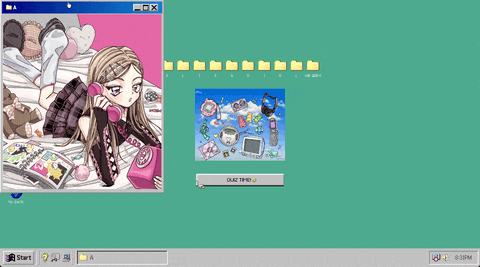
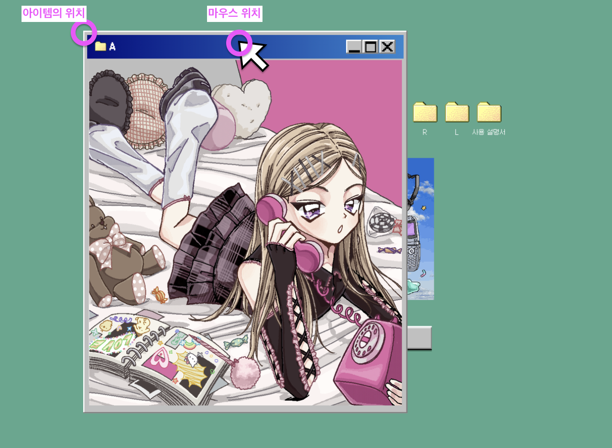
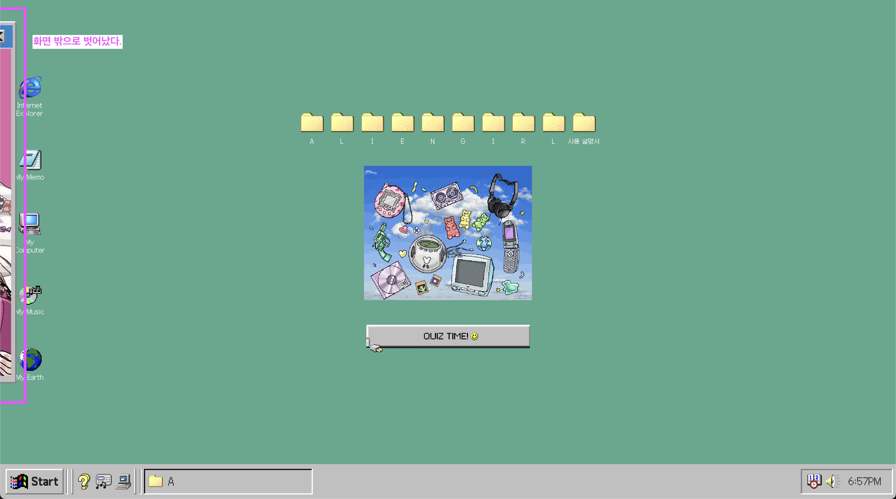

## 목차

1. 목표 기능
2. 구현 아이디어
3. 상세 구현 내용
4. 마무리

---

## 목표 기능



윈도우 창을 드래그 할 수 있는 기능이다. react-draggable 라이브러리를 이용하면 손쉽게 구현할 수 있지만 어떻게 구현해야 하는지 알아보기 위해 구현한다.

## 구현 아이디어

**react-draggable 구현 참고하기**

react-draggable 라이브러리를 사용하면 아이템을 드래그앤 드롭 이벤트를 쉽게 구현할 수 있다. 아이템은 CSS transform을 이용해 위치를 움직인다.

[react-draggable 라이브러리](https://github.com/react-grid-layout/react-draggable)는 어떻게 구현했는지 짧게 확인해보았다.

```tsx
// /lib/Draggable.js

type DraggableState = {
  dragging: boolean,
  dragged: boolean,
  x: number, y: number,
  slackX: number, slackY: number,
  isElementSVG: boolean,
  prevPropsPosition: ?ControlPosition,
};

export type DraggableDefaultProps = {
  ...DraggableCoreDefaultProps,
  axis: 'both' | 'x' | 'y' | 'none',
  bounds: Bounds | string | false,
  defaultClassName: string,
  defaultClassNameDragging: string,
  defaultClassNameDragged: string,
  defaultPosition: ControlPosition,
  scale: number,
};

export type DraggableProps = {
  ...DraggableCoreProps,
  ...DraggableDefaultProps,
  positionOffset: PositionOffsetControlPosition,
  position: ControlPosition,
};

class Draggable extends React.Component<DraggableProps, DraggableState> {
    // ...
  onDrag: DraggableEventHandler = (e, coreData) => {
    if (!this.state.dragging) return false;
    log('Draggable: onDrag: %j', coreData);

    const uiData = createDraggableData(this, coreData);

    const newState = {
      x: uiData.x,
      y: uiData.y,
      slackX: 0,
      slackY: 0,
    };
// ...
```

`DraggableProps` 보면 드래그 하는 상태(dragging, dragged)와 엘리먼트 위치(x, y)를 확인할 수 있다. 또 드래그 이벤트 구현체인 `onDrag` 메서드에서 `createDraggableData` 함수를 이용해 엘리먼트 위치를 업데이트한다.

`createDraggableData` 함수는 현재 위치, 이동한 델타 값 그리고 마지막 위치를 반환하고 있다.

```tsx
// /lib/utils.positionFns.js

export function createDraggableData(draggable: Draggable, coreData: DraggableData): DraggableData {
  const scale = draggable.props.scale;
  return {
    node: coreData.node,
    x: draggable.state.x + (coreData.deltaX / scale),
    y: draggable.state.y + (coreData.deltaY / scale),
    deltaX: (coreData.deltaX / scale),
    deltaY: (coreData.deltaY / scale),
    lastX: draggable.state.x,
    lastY: draggable.state.y
  };
```

이를 통해 알 수 있는 것은 아이템의 현재 위치, 이동한 델타 값, 마지막 위치를 활용해서 위치를 업데이트 하는 것을 알 수 있다.

**아이템 위치 업데이트하기**

아이템의 현재 위치, 이동한 델타 값은 마우스 이벤트에서 제공하는 뷰포트의 좌표값인 `clientX`, `clientY` 를 사용하면 된다.

먼저 마우스가 이동한 델타값을 구해보자. `현재 마우스 위치 - 마지막 마우스 위치` 을 계산하면 된다.

아이템의 위치는 아이템의 좌측 상단의 값으로 계산해줘야 한다. 아이템은 transform을 이용해 업데이트 하는데 transform의 기준은 아이템의 좌측 상단이기 때문이다. `현재 좌측 상단의 값 + 델타값` 을 계산하면 된다.



## 상세 구현 내용

### 드래그 앤 드롭이벤트 구현하기

드래그 앤 드롭 이벤트를 구현하기 위해 `isDragging`인 상태를 추가했다. 이 상태 값이 true인 경우 `handleDrag` 를 실행시킨다.

```tsx
const [isDragging, setIsDragging] = useState(false);
const ref = useRef<HTMLDivElement>(null);

const handleDragStart = () => {
  setIsDragging(true);
};

const handleDragStop = () => {
  if (!isDragging) return;

  setIsDragging(false);
};

const handleDrag = () => {
  if (!ref.current) return;
  if (!isDragging) return;

  // TODO: 아이템 위치 업데이트
};

useEffect(() => {
  if (isDragging) {
    document.addEventListener('mousemove', handleDrag);
  }

  return () => {
    document.removeEventListener('mousemove', handleDrag);
  };
}, [isDragging]);

return (
    <div
      ref={ref}
      onMouseDown={handleDragStart}
      onMouseUp={handleDragStop}
    >
      {children}
    </div>
  );
}
```

### 아이템 위치 업데이트 하기

아이템 위치를 업데이트하기 위해 아이템의 현재 위치, 이동한 델타 값, 마지막 위치 값이 필요하다.

아이템의 현재 위치와 마지막 위치 정보를 저장하기 위해 `position` 과 `last` 상태 값을 추가했다.

```tsx
// 아이템 위치
const [position, setPosition] = useState({
  x: 0,
  y: 0,
});
// 마지막 위치
const [last, setLast] = useState({
  x: defaultPosition.x,
  y: defaultPosition.y,
});
```

마우스가 이동한 델타 값은 현재 마우스 위치 - 마지막 마우스 위치 로 구할 수 있다.

```tsx
const deltaX = e.clientX - last.x;
const deltaY = e.clientY - last.y;
```

마지막으로 아이템의 위치를 업데이트할 값인 좌측 상단의 값은 `현재 좌측 상단의 값 + 델타값` 로 구하면 된다.

```tsx
const deltaX = position.x + e.clientX - last.x;
const deltaY = position.y + e.clientY - last.y;
```

구한 delta값으로 아이템의 위치를 업데이트 하면 끝이다.

```tsx
ref.current.style.transform = `translate(${deltaX}px, ${deltaY}px)`;
```

전체 코드는 이렇다.

```tsx
const [isDragging, setIsDragging] = useState(false);
// 아이템 위치
const [position, setPosition] = useState({
  x: 0,
  y: 0,
});
// 마지막 위치
const [last, setLast] = useState({
  x: defaultPosition.x,
  y: defaultPosition.y,
});
const ref = useRef<HTMLDivElement>(null);

const handleDragStart = (
  e: MouseEvent | React.MouseEvent<HTMLDivElement, MouseEvent>
) => {
  setLast({
    x: e.clientX,
    y: e.clientY,
  });
  setIsDragging(true);
};

const handleDragStop = (
  e: MouseEvent | React.MouseEvent<HTMLDivElement, MouseEvent>
) => {
  if (!isDragging) return;

  setIsDragging(false);
};

const handleDrag = (e: MouseEvent) => {
  if (!ref.current) return;
  if (!isDragging) return;
  e.preventDefault();

  const deltaX = e.clientX - last.x + position.x;
  const deltaY = e.clientY - last.y + position.y;

  setPosition({ x: deltaX, y: deltaY });
  setLast({
    x: e.clientX,
    y: e.clientY,
  });

  ref.current.style.transform = `translate(${deltaX}px, ${deltaY}px)`;
};

useEffect(() => {
  if (isDragging) {
    document.addEventListener('mousemove', handleDrag);
  }

  return () => {
    document.removeEventListener('mousemove', handleDrag);
  };
}, [isDragging]);

return (
    <div
      ref={ref}
      style={{
        position: 'absolute',
        top: defaultPosition.y,
        left: defaultPosition.x,
      }}
      onMouseDown={handleDragStart}
      onMouseUp={handleDragStop}
    >
      {children}
    </div>
  );
}
```

### 화면 밖으로 벗어나지 않기

드래그는 이제 잘 된다! 그러나 아이템이 화면 밖으로 벗어나는 문제점이 있다. 상하좌우 밖으로 벗어나지 않도록 개선해보자.



**상단 밖으로 벗어나는 경우**

`아이템의 초기 y + 델타 y` 이 0보다 작은 경우 상단 밖으로 벗어나는 케이스이다. 아이템을 상단에 고정시키기 위해 `-아이템의 초기 y` 로 위치를 업데이트 하면 된다.

```tsx
const fixToTop = (ref: HTMLDivElement) => {
  setPosition({ x: deltaX, y: -defaultPosition.y });
  setLast({
    x: e.clientX,
    y: e.clientY,
  });
  ref.style.transform = `translate(${deltaX}px, ${-defaultPosition.y}px)`;
};
```

**하단 밖으로 벗어나는 경우**

`아이템의 초기 y + 델타 y + 아이템의 높이` 가 뷰포트의 높이보다 큰 경우 하단 밖으로 벗어나는 케이스이다. 아이템을 하단에 고정시키기 위해 `뷰포트 높이 - 아이템 높이 - 아이템의 초기 y` 로 위치를 업데이트 하면 된다.

```tsx
const eleHeight = ref.current.clientHeight || 0;

const fixToBottom = (ref: HTMLDivElement) => {
  setPosition({
    x: deltaX,
    y: window.innerHeight - eleHeight - defaultPosition.y,
  });
  setLast({
    x: e.clientX,
    y: e.clientY,
  });
  ref.style.transform = `translate(${deltaX}px, ${
    window.innerHeight - eleHeight - defaultPosition.y
  }px)`;
};
```

**좌측 밖으로 벗어나는 경우**

아이템이 상단 밖으로 벗어나는 경우처럼 계산하면 된다.

```tsx
const fixToLeftTop = (ref: HTMLDivElement) => {
  setPosition({ x: -defaultPosition.x, y: -defaultPosition.y });
  setLast({
    x: e.clientX,
    y: e.clientY,
  });
  ref.style.transform = `translate(${-defaultPosition.x}px, ${-defaultPosition.y}px)`;
};
```

**우측 밖으로 벗어나는 경우**

아이템이 하단 밖으로 벗어나는 경우처럼 계산하면 된다.

```tsx
const eleWidth = ref.current.clientWidth || 0;

const fixToRight = (ref: HTMLDivElement) => {
  setPosition({
    x: window.innerWidth - eleWidth - defaultPosition.x,
    y: deltaY,
  });
  setLast({
    x: e.clientX,
    y: e.clientY,
  });
  ref.style.transform = `translate(${
    window.innerWidth - eleWidth - defaultPosition.x
  }px, ${deltaY}px)`;
};
```

여기서 대각선 방향으로 벗어나는 경우까지 추가하면 외부로 벗어나지 않는 드래그 이벤트를 구현할 수 있다.


## 마무리

드래그 이벤트를 구현하면서 뷰포트, 마우스 좌표값을 활용하는 것을 익힐 수 있었다. 또한 라이브러리 의존성을 성공적으로 제거하여 구현 능력을 키울 수 있었다.
