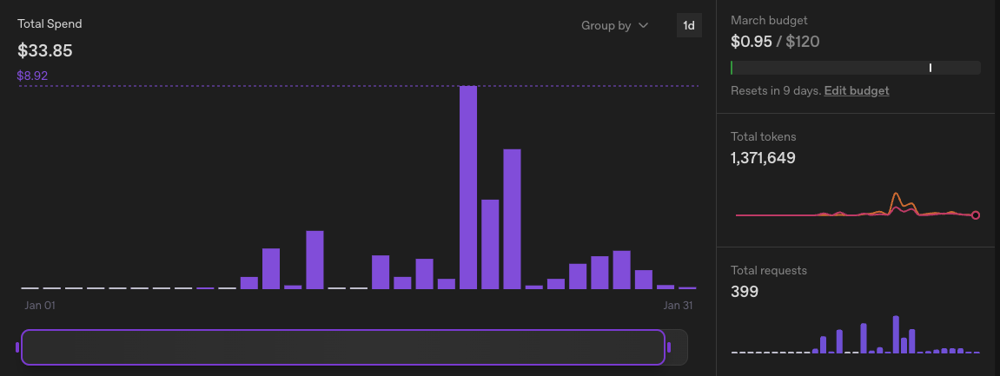
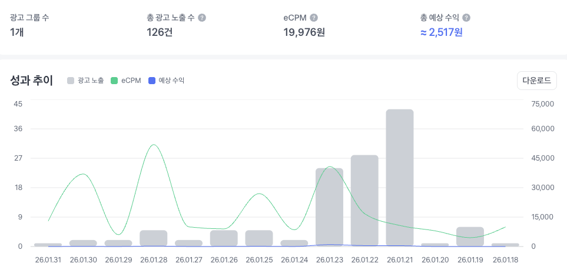
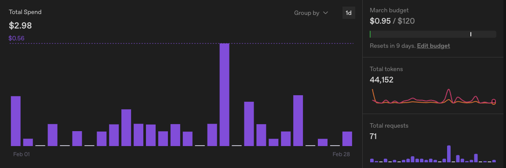

import videoSrc from './mushlook-demo.mp4'

최근 사이드 프로젝트로 개발자 지인과 함께 퇴근 후, 1-2시간 짬내서 기획부터 개발까지 약 2주에 걸쳐 "머쉬룩(MushLook)"이라는 앱인토스 미니앱을 만들었습니다.

머쉬룩은 AI를 활용해 반려동물 사진에 버섯 코스튬을 씌워주는 이미지 생성 서비스입니다. 아래는 데모 영상입니다. 간단하죠?

<video src={videoSrc} controls style={{width: '100%'}} />

프로젝트를 진행하면서 느낀 점들을 인터뷰 형식으로 정리해봤습니다.

---

🐹: 안녕하세요

🦒: 네 안녕하세요

🐹: 제 프로젝트에 참여해주셔서 감사합니다.

🦒: 네

🐹: 왜 참여하셨어요?

🦒: 같이 하자고 해서요.

🐹: 프로젝트 진행하면서 AI 에이전트를 활용할 수 있어서 좋았던 것 같아요.

🦒: Claude가 거의 다 했습니다. 저는 크게 한 게 없습니다.

🐹: 기린 씨는 뭘 하셨죠?

🦒: Claude한테 명령했습니다. "작업해줘", "디자인해줘", "수정해줘".

🐹: 앱인토스 SDK 문서를 사용하는 데 어려움은 없었나요?

🦒: 토스에서 LLM 플러그인을 설치해서 Claude Code에게 대부분 작업을 맡겼습니다.

---

🐹: 프로젝트에서 가장 쉬웠던 점은 뭐였나요?

🦒: 사진 입력을 받아 OpenAI API로 요청을 보내는 기본 기능 구현이 가장 쉬웠습니다.

---

🐹: 가장 어려웠던 점은요?

🦒: 비용 최적화였습니다.

기능을 만들고 보니 비용이 너무 많이 나왔습니다.

퀄리티를 낮추면 원본 이미지가 아예 훼손되는 문제가 있어서 굉장히 어려웠습니다.

예를 들어 API 품질을 낮추면 원본 골든리트리버 이미지의 포즈가 변형되는 문제가 있었습니다.

---

🐹: 비용이 진짜 많이 나왔잖아요.
운영한 지 약 2주 정도 됐는데 **33.76달러** 정도 과금됐고
테스트할 때도 실제 API를 사용해서 개발 단계에서도 계속 과금이 발생했죠.

 

🦒: 그리고 1월 수익은 **1.5달러 (한화 약 2천 원)** 정도입니다.

이미지나 영상 서비스는 잘못 건드리면 파산할 것 같아 최적화를 진행했습니다.

---

🐹: 최적화는 어떻게 하셨죠?

🦒: 이미지 경량화를 했습니다.

구조는 다음과 같습니다.

이미지 업로드 → S3 저장 → Lambda에서 이미지 경량화 → 다시 S3 업로드 → Open API 요청

---

🐹: 클라이언트에서 최적화할 수도 있지 않나요?

🦒: 토스 미니앱 환경에서는 **Node 서버를 사용할 수 없어서** Lambda를 활용한 방식으로 처리했습니다.

---

🐹: 비용은 얼마나 절감됐나요?

🦒: 전과 비교했을 때, 1건당 **50% 정도** 절감됐습니다. 근데 광고 수익이 안 나와서 그래도 파산입니다.

---

🐹: ㅋㅋㅋㅋ BM을 다시 생각해야겠네요.

---

🐹: 프로젝트 하면서 제일 재밌었던 건 뭐였나요?

🦒: 비용 최적화 작업이었습니다.

AI 서비스는

- 가격
- 토큰 사용량
- 인풋 / 아웃풋
- 서버 구조

이런 것들을 같이 봐야 해서 재미있었습니다.

---

🐹: 프론트엔드인데 서버까지 다 보셨네요.

🦒: 요즘 개발 흐름이 그런 것 같습니다.

AI가 많이 발전하면서 개발자가 직접 하는 작업은 줄고 AI 툴을 활용해서 생산성을 올리는 방식이 많아졌습니다.

예를 들어 AWS CLI 권한만 주면 서버 세팅도 AI가 다 해주기도 합니다.

다만 권한을 주면 어떻게 될지 몰라서 이번 프로젝트에서는 수기로 설정했습니다.

---

🐹: 초보자가 인프라까지 AI에 맡기면 과금 폭탄 맞겠네요.

---

🐹: AI로 코드를 만들다 보니 코드를 잘 안 읽게 되던데 정상인가요?

🦒: 네.

저는 코드가 어떻게 돌아가는지 잘 모릅니다.

---

🐹: 손쉽게 동작하는 코드를 만들 수 있어서 재밌긴 하더라고요.

🦒: 🐹는 어땠어요?

---

🐹: 어떤 부분이요?

🦒: Codex CLI요.

🐹: 저는 Cursor를 사용했는데 왜 CLI를 사용하는지 궁금했습니다.

Codex는 전반적인 코드 작성을 도와주고 Cursor는 작은 코드 단위를 질문하기 좋았습니다.

그리고 CLI 기반이라 창 전환이 적은 것도 좋았습니다.

---

🦒: AI 활용 관련해서 다른 경험은 없나요?

🐹: 앱 기획이랑 로고 이미지 생성도 AI로 만들었습니다.

처음에는 텍스트로만 요청했는데 마음에 안 들어서 간단한 스케치를 만들어 전달했습니다.

그러니까 훨씬 좋은 결과가 나왔습니다.

---

🦒: 그 과정에서 중요하다고 느낀 점은 없었나요?

🐹: 내가 원하는 결과를 **정확하게 정의하고 전달하는 것**이 결과 품질을 크게 좌우한다는 걸 느꼈습니다.

---

🦒: 앞으로 AI 활용법을 많이 찾아보세요.

🐹: 네.

🦒: 제 생각에는 AI를 더 적극적으로 사용하셔야 할 것 같습니다.

---

🐹: 조언 좀 해주세요.

🦒: 저도 잘 쓰는 편은 아니지만 이제 직접 코드를 치는 일은 점점 줄어드는 것 같습니다.

지금 하고 있는 작업들을 AI 기반 대화형 작업으로 바꿔보는 걸 추천합니다.

예를 들어 **Notion도 MCP 연동**이 가능합니다.

Claude 같은 AI와 연결하면

- Notion 이슈 생성
- 문서 분석
- 데이터 정리

같은 작업도 자동화할 수 있습니다.

그리고 CLI뿐 아니라 채팅 플랫폼에도 연동할 수 있습니다.

---

🐹: 오.

🦒: QA 자동화도 "자동화를 위한 자동화"를 AI로 어떻게 만들 수 있을지 고민해보면 좋을 것 같습니다.

---

🐹: 감사합니다.

🦒: 결론은…

**AI에 돈 쓰세요.**

---

🐹: 그러면 한 달에 얼마 쓰세요?

🦒: 지금은

- Claude Code → 110달러
- Gemini → 학생 라이선스 (1년 무료)

이렇게 쓰고 있습니다.

GPT도 쓰고 싶은데 돈이 없습니다.

GPT는 기획이나 코드 리뷰에 쓰고 Claude는 구현에 쓰고 Gemini는 프론트 디자인 생성에 활용해보고 싶습니다.

---

🐹: 프론트 디자인 생성은 피그마랑 다른 건가요?

🦒: 디자인이 없거나 피그마 디자인이 부족할 때 **Gemini가 더 좋은 결과를 만들어주는 경우가 있습니다.**

그래서 요즘은

Gemini + Codex + OpenCode 또는 Claude Code + 각자 IDE

이런 식으로 많이 사용합니다.

결론은 이제 IDE도 하나만 쓰는 시대가 아닌 것 같습니다.

---

🐹: 그렇군요.

🦒: 저는 Claude를 쓰고 있고 Cursor는 이제 안 씁니다.

🐹: 왜 안 쓰세요?

🦒: 결제를 안 하니까 그냥 VSCode가 되더라고요.

그리고 자체 모델이 아니라서 가격 대비 효율이 조금 애매했습니다.

---

🐹: 그러면 마지막으로 요즘 코딩 메타를 공유해주세요.

🦒: 요즘은 **코드보다 요청이 더 중요해지는 것 같습니다.**

AI에게 어떻게 질문하고 어떤 결과를 원하는지 명확하게 전달하는 것이 중요합니다.

그리고 결과물을 안정적으로 만들기 위해서는 **테스트 코드가 있는 것이 좋다고 생각합니다.**

---

기능 하나 수정할 때 대략 이런 흐름입니다.

1. AI에게 코드 생성 요청
2. 실행 및 검증 (이것도 AI에게 요청)
3. 코드 리뷰 플러그인 사용
4. 커밋 및 PR 생성
5. GitHub Actions 실행
6. 테스트 수행
7. Copilot 리뷰
8. 수정 요청
9. Merge

---

프로젝트를 다시 한다면 다음도 추가할 것 같습니다.

GA MCP 연동 이벤트 텍소노미 설계 데이터 분석 자동화

---

🐹: 네, 그러면 회고 인터뷰 마치겠습니다.

다음에 또 재밌는 프로젝트 해요.

🦒: 네~

---

## 이번 프로젝트에서 배운 점

이번 프로젝트를 하면서 느낀 점은 하나였습니다.

**이제 코드를 잘 쓰는 것보다 AI에게 잘 요청하는 능력이 더 중요해지고 있다는 것.**

그리고…

**AI 서비스는 생각보다 돈이 많이 듭니다.**
