퍼블리싱 속도를 높이고 레이아웃을 잡는 연습을 하기 위해 2024.11.10부터 4주간 퍼블리싱
스터디에 참여했다. 동일한 Figma 디자인 시안으로 퍼블리싱을 진행해 다른 스터디원의
노하우를 엿볼 수 있었다. 스터디에 참여하면서 grid, flex를 더 적극적으로 활용할 수
있게 되었고, 퍼블리싱 팁뿐만 아니라 디렉토리 구조에 대해서도 지식을 넓힐 수 있었다.

## week01

**TL;DR**

- 이미지 사이즈를 주는 방법은 3가지로 있고, 적재적소에 알맞게 사용하는게 좋다.
- scss도 module을 지원한다. 하지만 CSS-in-JS가 선호되는 이유를 알겠다.

**Figma 디자인 시안**

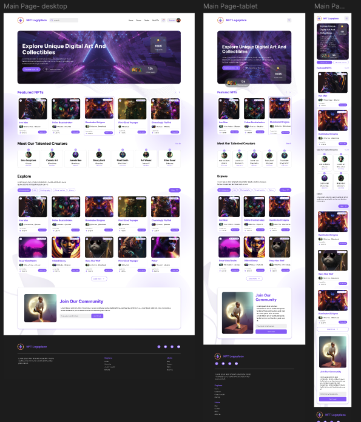

**scss**

개인적으로 CSS로 처리할 수 있는 작업은 CSS를 사용하는 것을 선호해 SCSS로 스타일링을 시도해보았다. 하지만 SCSS에서는 변수를 사용하려면 스타일 파일에서 명시적으로 연결해주어야 하는 점이 불편했다. 반면 CSS-in-JS는 변수를 쉽게 받아와 사용할 수 있다는 점이 큰 장점으로 느껴졌다.

```
// /styles/variables.scss

// breakpoint를 변수로 관리했다.
$tablet-breakpoint: 767px;
$pc-breakpoint: 1024px;
```

```
// button.module.scss에서 정의한 변수를 사용하려면 @use를 한다.
@use '/styles/variables.scss' as var;

.foo {
  @media (min-width: var.$tablet-breakpoint) {
    // ...
  }
}
```

**이미지 사이즈는 어떤 방법으로 줄까?**

이미지 사이즈를 조정하는 방법은 이렇게 3가지가 있다. 어떤 방식으로 이미지를 넣어줘야 하는지 애매모호해서 스터디원의 의견과 구글링을 통해 기준을 정리해보았다.

1.  이미지 태그에 직접 `width`, `height` 값 주기
2.  이미지 `width`는 100%로 하고 부모 요소를 통해 스타일 제어하기
3.  요소의 `background-image`속성으로 `object-position` 값을 주기

> 이미지에 직접 width, height 값 주기

- 디자인이 정적으로 고정되는 요소 (예: 해당 Fimga의 프로필 이미지)
- CLS를 방지하고 브라우저가 이미지 크기를 미리 알고 효율적으로 로드

> 이미지 width는 100%로 하고 부모 요소에 의존하기

- 컨테이너 레이아웃, 가변적으로 적용되는 요소 (예: 해당 Fimga의 카드 컴포넌트 썸네일)

> 요소의 background-image속성으로 object-position 값을 주기

- 꾸밈 이미지와 같이 내용에 영향을 주지 않는 요소
- 렌더 트리 생성 단계 이후에 이미지를 요청해 우선순위가 낮음

**상단 컨텐츠 레이아웃**

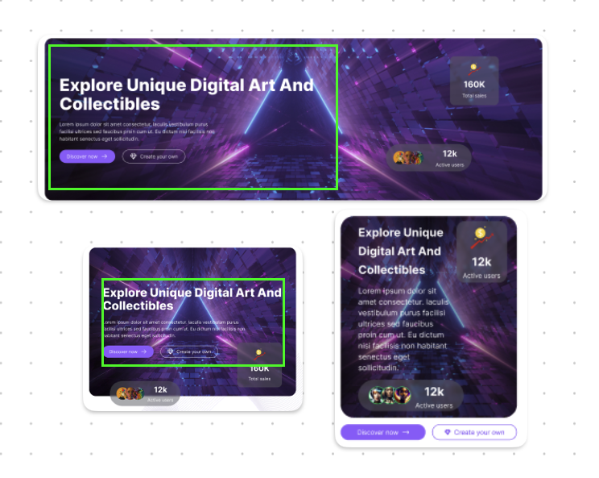

PC, 태블릿, 모바일 화면에서 레이아웃이 달라지는 디자인이다. 이 영역은 공통되는 초록생 영역을 기준으로 잡았다.

초록색 영역은 `flex-direction`을 `column` 으로 레이아웃을 잡았다. 모바일 화면에서는 버튼 컨테이너와 Active Users 위치를 각각 `absolute`로 했다.

**카드 리스트 레이아웃**

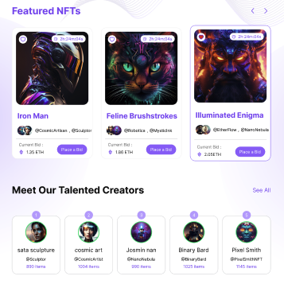 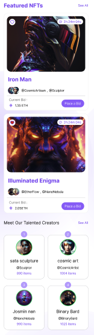

`Featured NFTs`와 `Cretors` 의 카드 영역은 모두 grid 레이아웃을 적용했다.

**새로 알게된 사실**

scss에서 `&__` 를 사용하면 상위 클래스 네임을 상속받을 수 있어 BEM 규칙을 따를 수 있다.

```

// 이것은
.text-box {
  &__title {
  }
}

// 이렇게 컴파일 된다.
.text-box{
}
.text-box__title {
}
```

**작업 결과**


## Week02

**TL;DR**

- `flex: 1 1 auto` 를 이해하고 사용했다.
- grid 레이아웃을 사용하면, 최대한 많은 요소를 보여주는 레이아웃을 그릴 수 있다.

**Figma 디자인 시안**

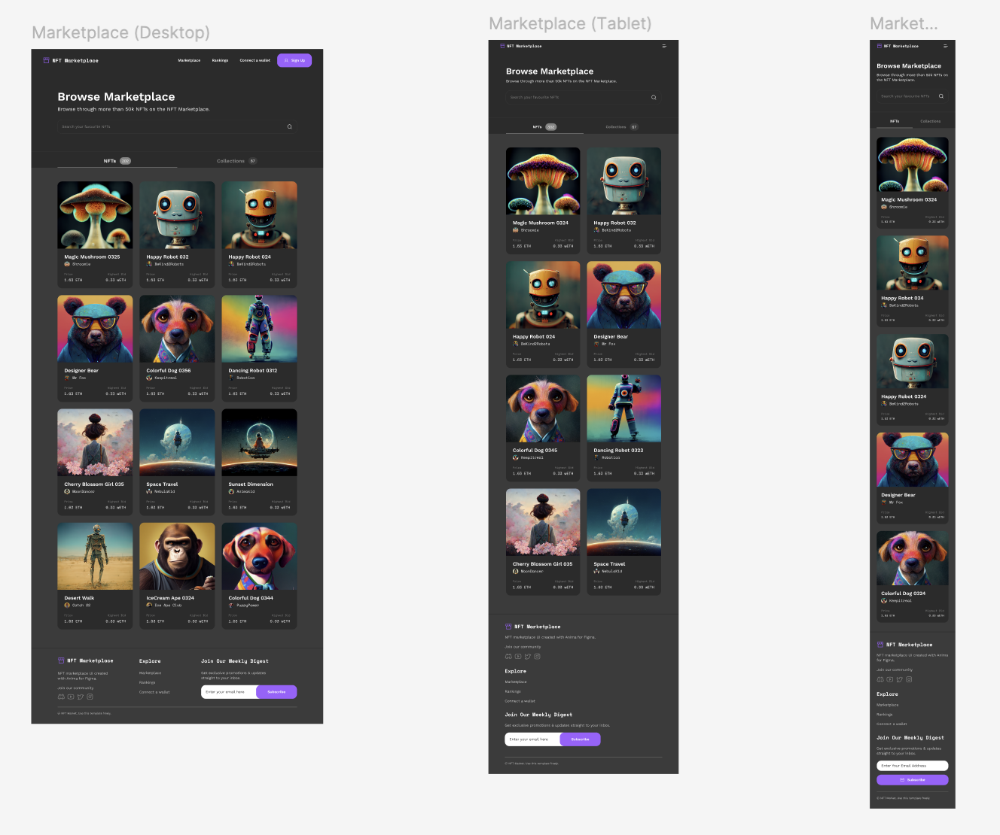

**emotion 사용**

디자인 재사용성을 높여보도록 `emotion`를 사용했는데, 퍼블리싱에만 집중했다. ^^;

**reset css**

[https://www.joshwcomeau.com/css/custom-css-reset/](https://www.joshwcomeau.com/css/custom-css-reset/) 를 사용했다.

그 중에, isolation 속성이 인상깊은데,

```
/* https://www.joshwcomeau.com/css/custom-css-reset/ */

/*
  9. Create a root stacking context
*/
#root, #__next {
  isolation: isolate;
}
```

> This is beneficial since it allows us to guarantee that certain high-priority elements (modals, dropdowns, tooltips) will always show up above the other elements in our application. No weird stacking context bugs, no z-index arms race.

모달, 드롭다운, 툴팁이 항상 다른 요소들 위에 표시되도록 보장할 수 있다고 한다.

**카드 레이아웃**

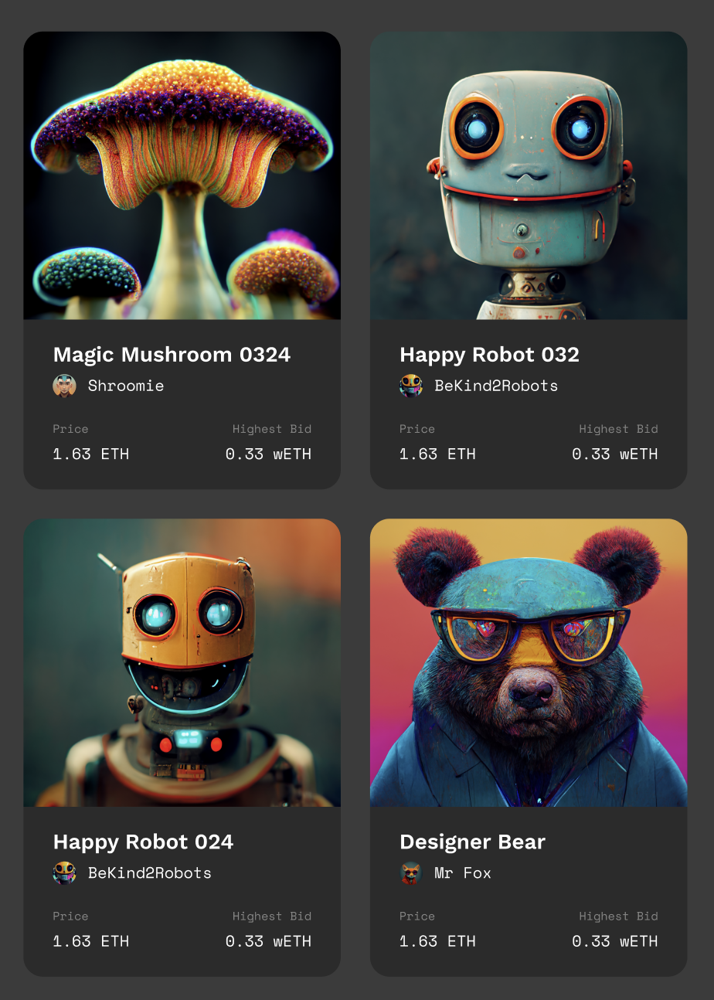

화면 해상도가 넓어지면 최대한 많은 카드를 보여주기 위해 `grid-template-columns` 속성을 사용하고 최소 카드 width를 `315px` 를 주었다.

```
const CardLayout = styled.div`
  display: grid;
  grid-template-columns: repeat(auto-fit, minmax(315px, 1fr));
  grid-gap: 20px;
`;
```

**탭 레이아웃**


두 버튼의 width 간격을 같은 비율로 맞춰주기 위해 `flex: 1 1 auto;` 를 적용했다. (미루고 미뤄왔던,,, `flex: 1 1 auto`를 이해했다. 😆)

Button을 width 100%로 둬도 동일한 효과를 줄 수 있다고 한다.

```
const TabContainer = styled.div`
  display:flx;
`
const Button = styled.div`
    width: 100%;
`
```

**Collection 하위 아이템 레이아웃**

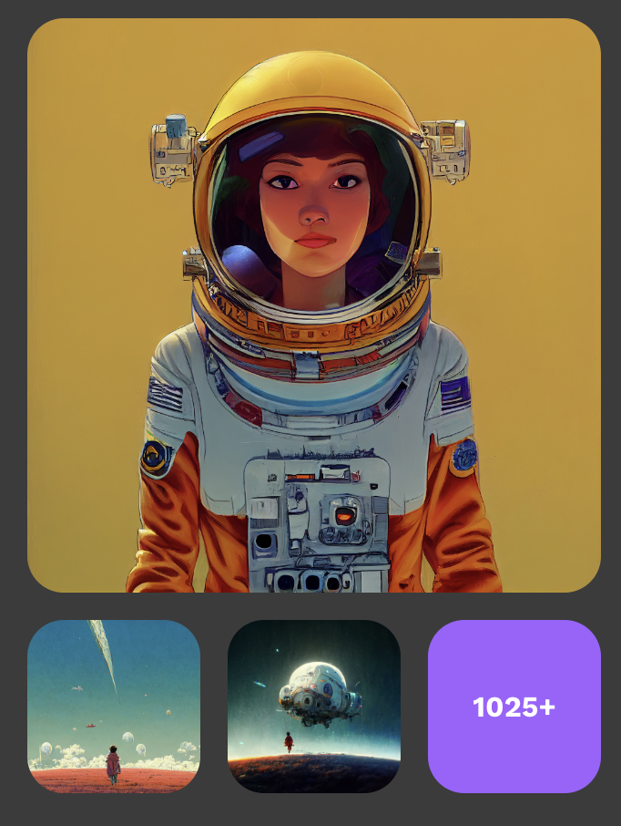

하위 아이템의 레이아웃은 최소 너비를 95px를 보장하고 균등하게 나누기 위해 `flex: 1 1 95px;` 을 사용했다.

하위 아이템 개수가 모자른 경우에는 조건문으로 빈 element를 넣어줬는데, grid-template-columns를 이용해 같은 공간을 3개로 균등하게 나누면 스크립트롤 작성하지 않아도 된다!

```
display: grid;
grid-template-columns: 1fr 1fr 1fr;
```

**작업 결과**


## week03

**TL;DR**

- Grid로 공백있는 레이아웃 표현하기

**Figma 디자인 시안**

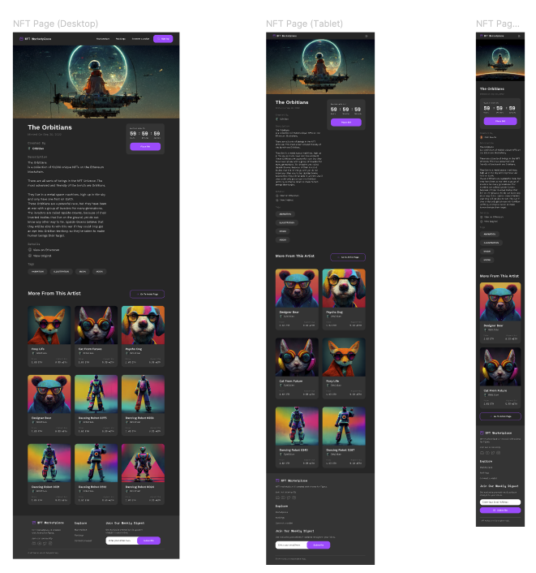

**그리드 시스템으로 공백이 있는 레이아웃 표현하기**

모바일에서는 컨텐츠가 일렬로 배치되어 있고 태블릿 이상부터는 두 열로 배치된다. flex를 사용하면 태블릿 이상부터는 표현하기 어려워진다. 그리드 시스템을 사용하면 일렬, 두 열 레이아웃을 간결하게 구현할 수 있다.

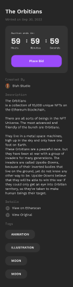 <br /> 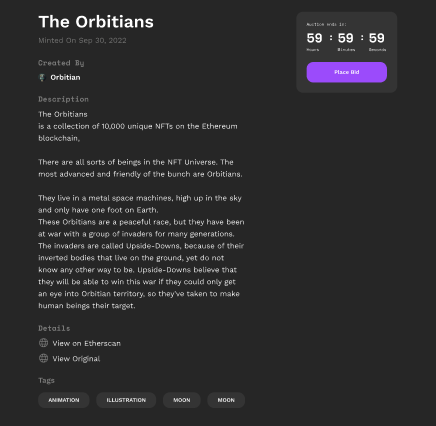 <br /> 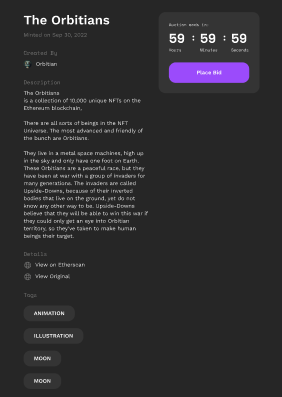

`grid-template-areas`를 사용하면 이름을 지정해 레이아웃을 배치할 수 있다. 각 그리드
아이템은 `grid-area` 속성으로 이름을 지정할 수 있다.

각 영역에 `grid-area` 로 적당한 이름으로 준 뒤, 컨테이너에 이렇게 하면 일렬로 배치할 수 있다.

```
const ContentsContainer = styled.div`
    grid-template-areas:
    'title'
    'endsIn'
    'creator'
    'description'
    'details'
    'tags';
  // ...
`;
```

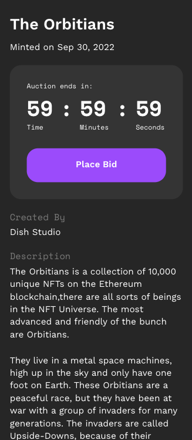

태블릿 크기 이상에서는 그리드 아이템을 두 열로 나누어 배치한다. endsIn 영역은 오른쪽 열에 위치시키고 title부터 description 영역까지 세로로 걸치게 했다. 나머지 영역은 '.'을 사용하여 공백 처리한다.

```
const ContentsContainer = styled.div`
  // ...

  @media (min-width: 834px) {
    grid-template-areas:
      'title title endsIn'
      'creator creator endsIn'
      'description description endsIn'
      'details details .'
      'tags tags .';
    // ...
    }
`;
```

`endsIn` 영역(타이머)이 `description`까지 늘어나게 되는데, 이는 해당 요소에 `height`를 지정하지 않아 왼쪽 컨텐츠의 높이값을 따라가기 때문이다. 이 문제를 해결하기 위해 `endsIn` 컨텐츠에 `min-content` 값을 적용하여 자신의 내용물 크기만큼만 높이를 가지도록 했다.

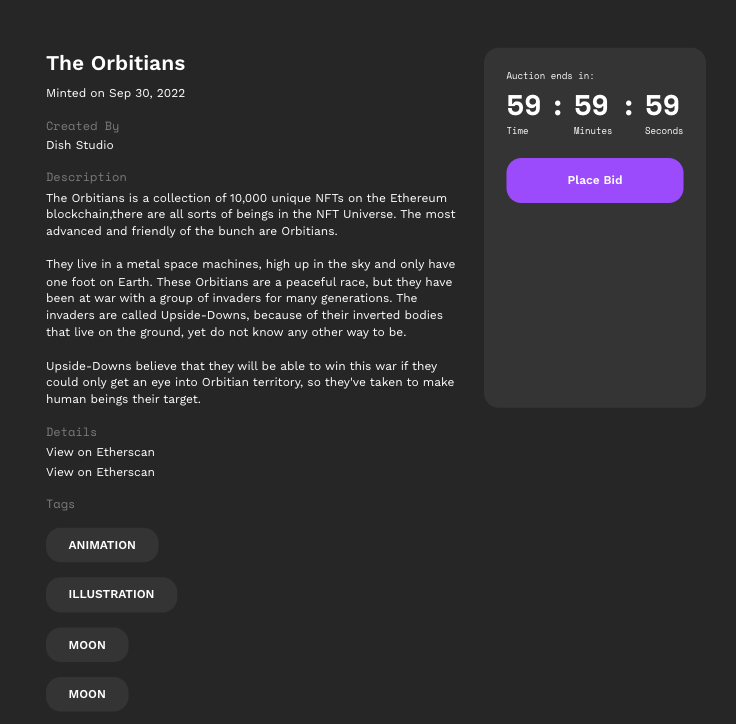

```
const EndsInBlock = styled.div`
  height: min-content;
  // ...
 `
```

아래는 전체 코드의 일부이다. 흥미로운 점은 마크업 순서와 관계없이 `grid-area`의 이름 속성만으로 요소 배치가 결정된다.

```
<ContentsContainer>
  <Title />
  <Creator />
  <Description />
  <Details />
  <Tags />
  <EndsIn />
</ContentsContainer>

const ContentsContainer = styled.div`
  gap: 20px;
  padding: 40px 30px;
  display: grid;
  grid-template-areas:
    'title'
    'endsIn'
    'creator'
    'description'
    'details'
    'tags';

  @media (min-width: 834px) {
    padding: 40px 72px;
    grid-template-columns: 1fr 295px;
    grid-template-areas:
      'title title endsIn'
      'creator creator endsIn'
      'description description endsIn'
      'details details .'
      'tags tags .';
    column-gap: 30px;
  }

  @media (min-width: 1280px) {
    padding: 40px 115px;
    column-gap: 150px;
  }
`;
```

**작업 결과**

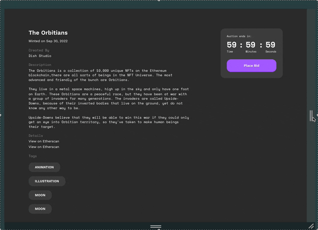

### week04

**TL;DR**

- 레이아웃 흐름을 방해하지 않고 스타일 주기

**Figma 디자인 시안**

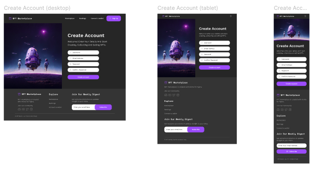

**Form 레이아웃**

grid 레이아웃으로 모바일에서는 1열로 배치하고 태블릿 이상부터는 `grid-template-areas`로 2열로 배치하도록 했다.

```
<FormContainer>
    <HeroBox />
    <FormBox />
</FormContainer>
```

```
const FormContainer = styled.div`
  display: grid;
  grid-template-columns: 1fr;

  @media (min-width: 834px) {
    grid-template-areas: 'hero form';
    grid-template-columns: 1fr 1fr;
  }
`;

const HeroBox = styled.div`
  // ...
  grid-area: 'hero';
`;

const FormBox = styled(FlexColumnBox)`
  // ...
  grid-area: 'form';
 `
```

**Input focus 스타일**

Input border스타일은 레이아웃에 영향을 주지 않는 `box-shadow`속성을 사용하고 `<InputEle/>` 에 focus가 활성화 됐을 때, 부모 컴포넌트에 포커스 스타일을 주기위해서 네이티브 focus스타일을 주지않고`:focus-within` 를 사용했다.

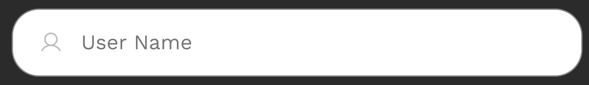

<br />
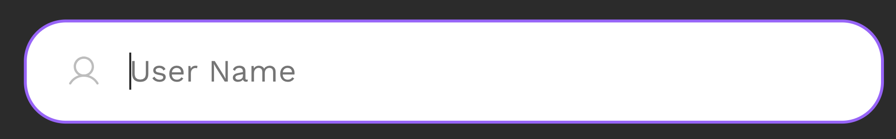

```
<InputContainer>
  <InputWrapper>
    <InputEle/>
  </InputWrapper>
  <ErrorMessage>
</InputContainer>
```

```
const InputWrapper = styled(FlexRowBox)`
  // ...
  box-shadow: 0px 0px 0px 1px rgba(133, 133, 132, 1);
  &:focus-within {
    box-shadow: 0px 0px 0px 1.5px rgba(162, 89, 255, 1);
  }
`;

const InputEle = styled.input`
  // ...
  outline: none;
`;
```

**에러 메세지 레이아웃**

에러메세지가 보여지면서 레이아웃 영향을 주지않도록 `absolute`를 사용했다.


```
<InputContainer>
  <InputWrapper>
    <InputEle/>
  </InputWrapper>
  <ErrorMessage>
</InputContainer>
```

```
const InputContainer = styled.div`
  position: relative;
`;

const ErrorMessage = styled.span`
  // ...
  position: absolute;
  margin-top: 1px;
`;
```

**작업 결과**

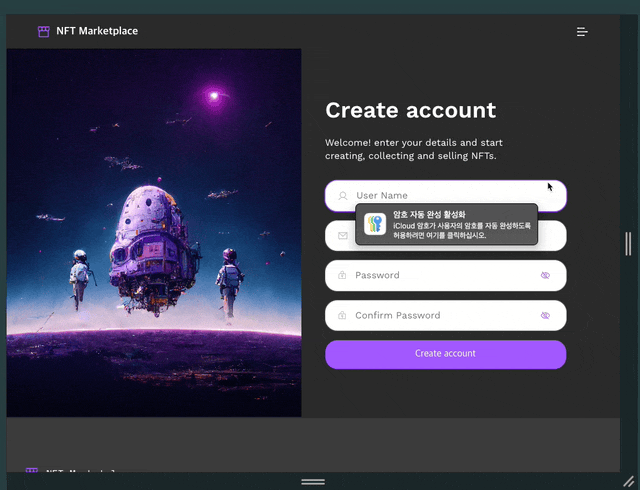
