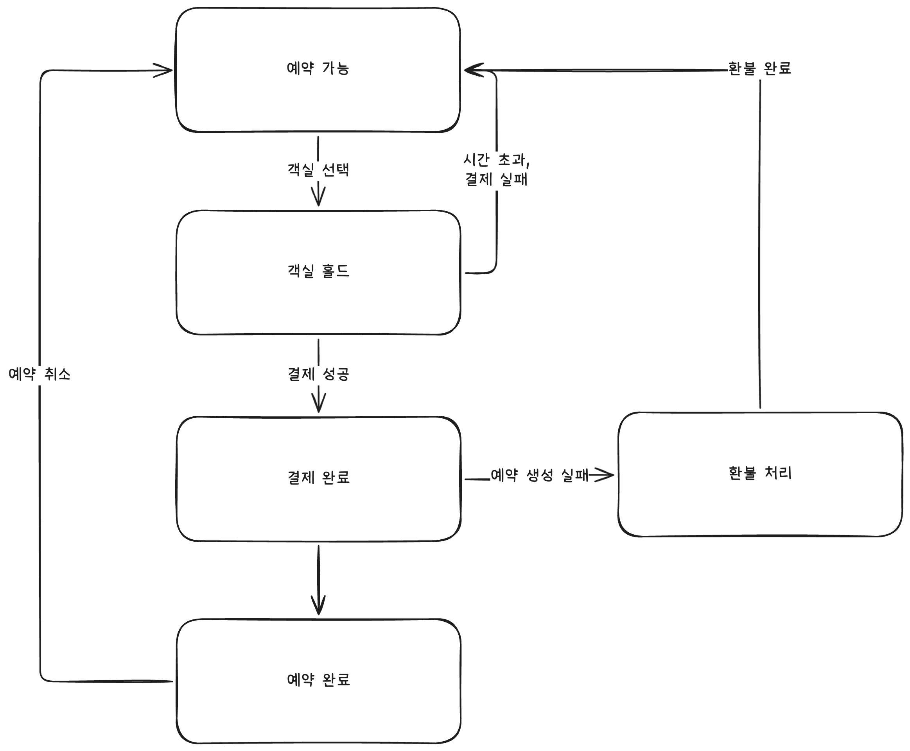

## 소프트웨어의 상태

소프트웨어에서 상태는 중요하다.
사용자의 행동이나 시스템에 의해 상태가 변경되고, 현재 상태에 따라 다음 상태와 가능한 행동이 결정된다.
예를 들어 쇼핑몰 주문을 생각해보자.
사용자가 결제를 완료하면 주문은 결제 완료 상태가 된다. 이후 판매자가 배송 준비 상태로 변경할 수도 있고, 사용자가 환불을 요청해 환불 상태로 변경될 수도 있다.
다루는 상태가 많아질수록 복잡성은 증가한다. 예약 시스템에서는 이런 버그가 발생할 수 있다.

- 결제 실패 후에도 객실 슬롯이 계속 점유되는 경우
- 환불 완료 후 예약 가능한 상태로 돌아가지 않는 경우
- 이미 예약 완료된 건에 대해 다른 사용자가 결제가 가능한 경우

이런 케이스는 어떻게 미연에 방지할 수 있을까?

## 상태 전이 모델

상태 전이 모델은 시스템의 상태와 상태 간 전이 조건을 시각적으로 표현하는 기법이다.
다이어그램으로 그린다면 시스템이 어떤 상태를 가지는지, 놓치기 쉬운 비즈니스 규칙 상태를 발견할 수 있다.
예약 시스템을 예를 들어보자. 처음에는 예약 가능, 결제 완료, 예약 완료, 환불 같은 상태가 떠오를 수 있다. 하지만 상태 전이 다이어그램을 그려보면 객실 홀드 상태가 필요하다는 사실을 발견할 수 있다.

## 상태 전이 테스트

이제 다이어그램을 기반으로 상태-이벤트 테이블과 테스트 케이스를 생성할 수 있다. 상태 전이 테스트에서는 n-switch coverage라는 개념을 사용할 수 있다. n-switch coverage는 길이가 n+1인 상태 전이 시퀀스를 검증하는 커버리지 기준이다.
상태가 많아질수록 테스트 케이스 수가 급격히 증가하기 때문에 보통 0-switch와 1-switch를 작성한다.
AI의 도움을 받아 빠르게 1-switch 커버리지를 달성하는 TC를 작성해보자.

<table>
<tr><th>TC ID</th><th>시작 상태</th><th>Event1</th><th>중간 상태</th><th>Event2</th><th>기대 상태</th></tr>
<tr><td>1SW-001</td><td>예약 가능</td><td>객실 선택</td><td>객실 홀드</td><td>결제 실패</td><td>예약 가능</td></tr>
<tr><td>1SW-002</td><td>예약 가능</td><td>객실 선택</td><td>객실 홀드</td><td>시간 초과</td><td>예약 가능</td></tr>
<tr><td>1SW-003</td><td>예약 가능</td><td>객실 선택</td><td>객실 홀드</td><td>결제 성공</td><td>결제 완료</td></tr>
<tr><td>1SW-004</td><td>객실 홀드</td><td>결제 성공</td><td>결제 완료</td><td>예약 생성 성공</td><td>예약 완료</td></tr>
<tr><td>1SW-005</td><td>객실 홀드</td><td>결제 성공</td><td>결제 완료</td><td>예약 생성 실패</td><td>환불 처리</td></tr>
<tr><td>1SW-006</td><td>결제 완료</td><td>예약 생성 성공</td><td>예약 완료</td><td>예약 취소</td><td>예약 가능</td></tr>
<tr><td>1SW-007</td><td>결제 완료</td><td>예약 생성 실패</td><td>환불 처리</td><td>환불 완료</td><td>예약 가능</td></tr>
</table>

상태 전이 다이어그램 기반으로 모든 1-switch 상태를 검증하는 7개의 TC를 빠르게 작성했다.
추가로 무반응 테스트 케이스를 추가하면 허용하지 않는 이벤트에 대해 시스템 상태를 변경하지 않는지도 검증할 수 있다.
