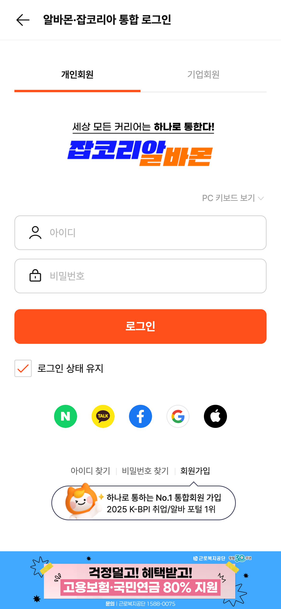

단순히 테스트 코드를 짜는 게 아니라 AI와 협업해 테스트 케이스를 설계하고, 실제 DOM과 흐름을 기반으로 자동화를 구현하는 전 과정을 경험할 수 있었다.

8월에 참여한 AI Challenge QA에 참여한 회고록을 작성해보겠습니다.

## 목표


챌린지 주제는 모바일 알바몬 개인 회원 로그인입니다.

AI를 잘 쓰는 사람이어야 한다고 생각합니다.
이전 개발 업무에서는 일상적으로 AI를 사용해봤어요. 이전에 다른 프로덕트에서 회원가입 후 리워드 포인트가 잘 지급되는지 playwright로 테스트를 AI를 활용해서 작성한 경험이 있음

그 기억을 되살려 테스트 케이스부터 테스트 코드 작성까지 적극적으로 AI를 활용해보고자 참여합니다.

이 챌린지에서 2가지를 고민하며 진행했습니다.

1. AI가 테스트 케이스 설계
2. Playwright로 로그인 플로우를 얼마나 깔끔하게 자동화

## AI 활용 과정

### 테스트 케이스 초안 생성

AI에게 로그인 기능의 범위만 알려주면 기본적인 TC는 꽤 잘 제시했습니다.

PRD를 구체적으로 전달하자

```
**You:**

다음 조건을 기반으로 로그인 기능 테스트 케이스를 작성해줘.

환경:

- 모바일 웹, Chrome/Edge 브라우저
- 로그인 폼: 아이디, 비밀번호 입력
- 로그인 성공 시: 마이페이지로 이동
- 로그인 실패 시: 브라우저 alert 창 표시

조건:

1. 성공, 실패, 예외 상황별로 각각 5개 (총 15개)
2. 표 형식: | 구분 | 설명 | 입력값 | 실행 조건 | 기대 결과 |
3. 기대 결과는 'UI 동작'(구체적 요소명)을 포함하여 최소 1줄 이상 작성
4. 예외 상황은 네트워크, 서버, 브라우저 환경 문제 등 비입력값 기반 케이스 포함
5. 각 케이스는 서로 다른 조건/시나리오로 작성
6. 실행 조건은 구체적으로 작성 (예: 버튼 클릭 시점, 서버 응답 지연 상태 등)

예시 표:
| 성공 | 올바른 아이디/비밀번호 입력 후 로그인 | id: user01, pw: Pass123 | 로그인 버튼 클릭 시 | UI: 마이페이지로 이동 |
```

- 성공 로그인
- 공란 입력
- 비밀번호 오류
- alert 메시지 검증
- 세션 만료 처리

전형적인 케이스는 AI가 빠르게 도출해줬다.

바로 드러난 한계

하지만 곧 문제들이 보였다.

실제 DOM을 모르기 때문에 test id 중심으로 선택자 제안

리다이렉트 흐름은 틀리게 이해하는 경우가 많음

예외 케이스는 “있을 듯한” 뉘앙스만 말해줘서 정확하지 않음

“AI가 모든 걸 대신해준다”는 환상이 바로 깨졌다.

내가 보완한 방식

그래서 다음과 같이 보조 작업을 했다.

실제 로그인 화면 캡처 제공

HTML 구조 일부 전달

테스트 작성 가이드 직접 작성

프롬프트를 재정리하며 반복 피드백

AI가 QA 일을 돕게 만든다 → AI에게 기대값을 명확히 알려준다
이 과정을 겪으면서 AI 활용 방식도 꽤 정교해졌다.

4. 테스트 케이스 설계 — “AI 초안 + 내 기준으로 보완”

로그인은 보안과 사용자 경험에서 핵심 기능이라,
AI가 만든 초안 위에 내가 실제 서비스 기준으로 TC를 추가·수정했다.

보완한 대표 케이스는:

앞뒤 공백 입력 (실제 사용자 실수 기반)

엔터 제출

미인증 상태에서 /mypage 접근 후 복귀

alert 메시지 문구 정확성

로그인 후 세션 만료 흐름

AI가 놓치는 디테일은 결국 현실 서비스 경험이 있는 사람이 보완해야 한다는 걸 다시 느꼈다.

5. Playwright 자동화 구현

테스트는 Playwright 기반으로 작성했다.

구현하면서 신경 쓴 점

beforeEach에서 항상 로그아웃 상태로 시작

getByPlaceholder로 선택자 관리

test.step으로 흐름을 단계별로 기록

alert 메시지 검증 포함

모바일 크롬 기준 시나리오 실행

작성 가이드와 DOM 구조를 AI에게 제공하니,
AI가 준 코드 품질도 점점 좋아지는 게 흥미로웠다.

6. 실행 결과

총 18개 테스트 중 16개 성공

총 소요 시간 48.3초

핵심 성공·실패 플로우는 모두 PASS

7. 실패 케이스 분석 — “AI 챌린지지만 실제 버그를 찾음”

가장 의미 있었던 부분이다.

❌ 실패한 케이스: 앞뒤 공백 트리밍 미처리

테스트 데이터

␣␣␣user01␣␣␣
␣␣␣Pass123!␣␣␣

예상 결과

입력값이 자동으로 trim되어 정상 로그인

실제 결과

API 400

"아이디 또는 비밀번호가 일치하지 않습니다." 표시

영향도 분석

모바일 입력 환경에서는 공백 실수가 흔함

실제 사용자도 “계정이 맞는데 왜 안되지?” 경험 가능

로그인 실패가 곧 사용자 경험 악화로 이어지는 부분

제안한 조치

프론트엔드: input.trim() 처리

백엔드: 동일한 트리밍 로직 적용

리그레션 테스트로 재검증

챌린지지만 실제 “서비스 품질 개선 포인트”까지 찾을 수 있었던 경험이었다.

8. 이 챌린지를 통해 얻은 인사이트

1) AI는 테스트 초안을 빠르게 만든다

하지만 기대값 정의, 플로우 정확성, DOM 이해는 결국 사람이 해야 한다.

2. 자동화는 반복 업무를 빠르게 대체한다

로그인 같은 영역은 Playwright만으로도 매우 빠르게 표준화 가능하다.

3. AI는 QA 엔지니어의 역량을 증폭시키는 도구

올바른 정보와 기준을 제공해야
“AI가 QA처럼 사고하게 만들 수 있다.”

이게 가장 크게 느낀 점이다.

9. 향후 개선

CI에서 스모크 테스트로 자동 실행

iOS Safari까지 확장

alert mock으로 메시지 검증 강화

비정상 로그인 반복 시도 브루트포스 방지 테스트

성공/실패 로그 기반 대시보드 시각화도 고려

마치며

챌린지라고 가볍게 시작했지만
AI를 QA와 어떻게 연결할 수 있을지 한 번에 정리할 수 있는 기회였다.

앞으로도 생산성을 높일 수 있는 반복 작업은 자동화하고,
나는 더 중요한 리스크 기반 탐색 테스트에 집중하기 위한 방향으로 성장하고 싶다.
