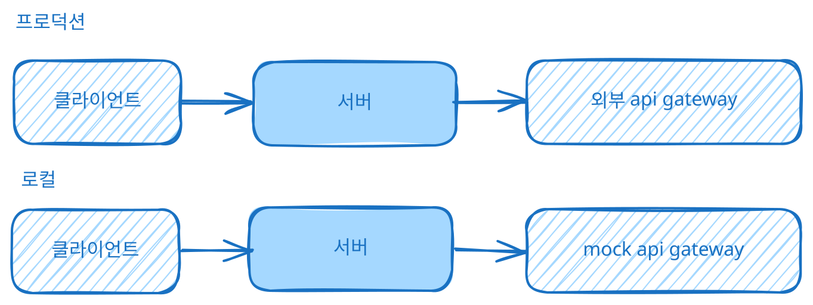

# 외부 API를 사용할 수 없을 때, 어떻게 테스트를 완료할까?

이 세 가지 상황일 때 어떻게 테스트를 완료하고 무사히 오픈할 수 있을까요?

1. 심지어 샌드박스용 API를 이용하려면 IP를 화이트리스트에 추가해야 함
2. 외부 API를 사용하려면 담당자와 커뮤니케이션을 해야 함
3. 그런데 당장 다음 주에 오픈해야 함

다행히 API 간의 통신은 모든 엔드포인트와의 통합 테스트를 완료한 상태였습니다.

그렇다면 오픈을 해도 되지 않을까요?

## E2E 테스트를 왜 해야 하는가

E2E 테스트는 사용자 관점에서 애플리케이션의 처음과 끝, 전체 흐름이 정상적으로 동작하는지 검증하는 테스트입니다.

통합 테스트와는 검증하는 범위가 다릅니다.

- 통합 테스트: API가 스펙대로 요청을 받고 응답하는가
- E2E 테스트: 그 응답을 받은 뒤, 화면 상태까지 올바르게 이어지는가

API가 정상적으로 응답하는 것과, 그 응답을 받은 화면이 정상적으로 동작하는 것은 다른 문제라고 생각했습니다.

브라우저 단에서 정상적으로 UI가 업데이트되는지 검증하기 위해서는 E2E 테스트가 필요했습니다.

## 외부 API를 사용할 수 없었어요

현재 샌드박스 API를 사용하려면 IP를 화이트리스트에 등록해야 했고, 당장 테스트를 완료하고 버그를 수정한 뒤 다음 주에 오픈 준비를 해야 했습니다.

그래서 로컬 환경에서 직접 검증하기로 했습니다.

## API를 직접 모킹했어요

WireMock을 이용하면 네트워크 장애 주입도 가능해서 더 정교한 시나리오를 테스트할 수 있었겠지만, 당장 필요한 것은 E2E 테스트였습니다.

그래서 실제 프로토콜의 요청/응답 형태, 필드, 에러 코드 등을 그대로 흉내 낸 Mock API를 AI의 도움을 받아 로컬 서버로 빠르게 띄웠습니다.

그리고 이 Mock API를 사용해서 실제 사용자 플로우를 따라가며 E2E 테스트를 진행했습니다.

```
const orders = new Map<string, string>(); // 주문 상태를 메모리에 저장함

app.post("/RegisterOrder", (req, res) => {
  orders.set(req.body.orderId, "REGISTERED");  
  res.json({ errorCode: "00" });
});

app.post("/GetOrderStatus", (req, res) => {
  const status = orders.get(req.body.orderId);
  if (scenario === "not_found" || !status) {
    return res.json({ errorCode: "01", reason: "No Data" });  
  }
  res.json({ errorCode: "00", status });
});
```




## 그래서 이러한 결함을 발견했어요

이렇게 띄운 Mock 서버로 E2E 테스트를 진행하자, API 응답은 정상적으로 내려오고 있었지만 화면의 상태값이 제대로 갱신되지 않는 결함을 발견했습니다.

API 통합 테스트에서는 발견하지 못했던 문제였습니다.

API 자체는 정상적으로 동작하고 있었지만, 그 응답을 받은 이후 프론트에서 상태를 처리하는 과정에서 문제가 있었던 것입니다.

결국 사용자가 실제로 화면을 사용하는 과정까지 테스트해봐야 발견할 수 있는 문제였습니다.

## API 모킹의 한계

그렇다고 이렇게 모킹한 API가 실제 외부 API와 완전히 같다고 할 수는 없었습니다.

실제로 담당자의 지원을 받아 프로덕션 환경에서 테스트해보니, 게이트웨이와 주고받는 payload에 차이가 있는 부분을 발견했습니다.

즉, Mock API를 이용해서 E2E 테스트를 진행하는 것만으로 실제 외부 API와의 연동까지 모두 보장할 수는 없었습니다.

Mock API는 테스트할 수 없는 상황에서 꽤 유용했지만, 결국 실제 API를 사용했을 때만 확인할 수 있는 영역도 존재했습니다.

## 정리

“API 통합 테스트를 완료했으니 오픈해도 되지 않을까?”라는 질문에 대한 답은 무엇을 검증했는지에 따라 다르다고 정리할 수 있을 것 같습니다.

통합 테스트는 API가 스펙대로 응답하는지를 검증한 것이고, 그 응답이 화면까지 올바르게 이어지는지는 검증하지 않았습니다. mock API 역시 실제 프로덕션 api와 동일하다고 보증할 수 없었습니다.

결국 테스트를 효율적으로 한다는 것은 모든 것을 다 검증하는 것이 아니라, **각 테스트가 무엇을 검증할 수 있는지 이해하고 어느 범위까지 검증할 것인지** 정하는 것이 아닐까 생각합니다.