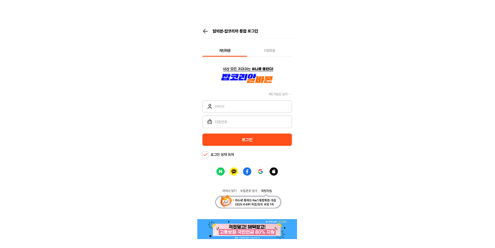
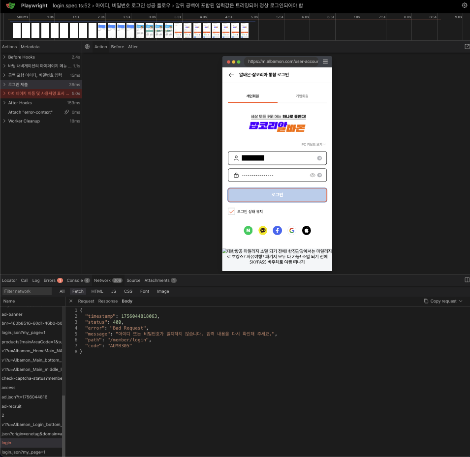

AI를 적극적으로 사용해서 테스트 설계와 테스트 코드 구현까지 경험할 수 있었던 AI Challenge QA 회고록을 자유롭게 작성해보았습니다. 


## AI를 QA도구로 써보자



챌린지 주제는 모바일 알바몬 개인 회원 로그인 자동화였습니다. 

예전에 다른 프로덕트에서 회원가입 후, 리워드 지급이 잘 되는지 E2E 테스트를 AI 도움으로 테스트 코드를 작성한 경험이 있는데, 그때 기억을 되살려 이번에는 테스트 케이스부터 적극적으로 AI를 활용해보고자 참여했습니다.

이 챌린지에서 세운 목표는 두 가지 입니다. 
1. AI로 테스트 케이스 작성하기
2. AI로 Playwright로 로그인 테스트코드 자동화하기

## PRD기반으로 테스트 케이스 생성하기

AI에 알바몬 개인 회원 로그인이 가지는 기본적인 PRD를 전달했습니다. 이를 바탕으로 AI가 테스트 케이스를 생성해줬습니다.

```bash
- 환경: 모바일 웹, Chrome/Edge 브라우저
- 로그인 폼에 아이디와 비밀번호를 입력한다.
- 로그인 성공 시, 마이페이지로 이동한다.
- 로그인 실패 시, 브라우저 alert 창 표시한다.
```

AI는 빠르게 입력값, 실행 조건, 기대 결과를 포함한 TC를 빠르게 만들어줬습니다. 하지만 바로 사용하기엔 다음과 같은 한계점이 있었습니다.
- 실제 DOM 구조를 몰라 임의의 선택자를 추천함 
- 상황에 맞지 않는 테스트 케이스를 제시함 

그래서 이후부터는 컨텍스트를 정교하게 제공했습니다. HTML 구조 알부를 전달하거나, 실제 사용자 흐름을 설명했습니다.

## Playwright 자동화 구현


테스트 자동화는 모바일, 웹 크로스 브라우저를 지원하는 Playwright를 사용했습니다. 

**시나리오**
- 로그인, 비밀번호 입력 후 로그인 성공 시 마이페이지로 이동
- 로그인 또는 비밀번호 공란시 로그인 실패 메시지 검증
- 로그인 세션 만료시 로그인 페이지 이동

**구현 전략**
- [Gist Playwright 테스트 작성 가이드.md](https://gist.github.com/devbrother2024/7803601764476f79dbdfaf312a7e2454)를 참고하여 
가이드를 작성했습니다.
- `beforeEach`에서 항상 로그아웃 상태로 시작
- `getByPlaceholder`로 접근자 선택자 위주로 사용하여 유지보수성을 고려
- `test.step`으로 흐름을 단계별로 기록

웹 페이지가 완전히 로드되지 않은 상태에서 테스트 코드가 실행되어 에러가 발생하는 케이스에서는 **URL or 요소 기준으로 대기**해 테스트 안정성을 확보했습니다.


### 실행 결과


- 테스트 약 18건 중 대부분 성공
- 전체 플로우 실행 시간: 48.3초

대부분의 케이스는 PASS했지만, 한 케이스에서는 Fail이 발생했습니다.

**실패 케이스: 트리밍 미처리**



유효한 아이디, 비밀번호에 공백을 입력시, 공백이 올바르게 트리밍 되는 것응 기대했으나, Fail했습니다. 

유효한 아이디/비밀번호 앞뒤에 공백을 넣어서 입력하면,
```bash
␣␣␣{유효한 아이디}␣␣␣ 
␣␣␣{유효한 비밀번호}␣␣␣
```
공백을 trim하고 정상 로그인 처리를 기대했으나, 실제로는 400에러가 발생했습니다. 

## AI와 협업하며 느낀 점

이 챌린지를 통해 AI는 결과물을 빠르게 만드는 것을 체감했습니다. 하지만 기대값 정의, 플로우 정확성, DOM 이해는 결국 사람의 손이 필요해 테스트 결과의 검토는 사람이 해야 한다는 것을 느꼈습니다.

AI를 잘 사용해 사람이 해야 하는 탐색적 테스트와 리스크 기반 테스트에 더 집중하는 QA 엔지니어가 되고 싶습니다.