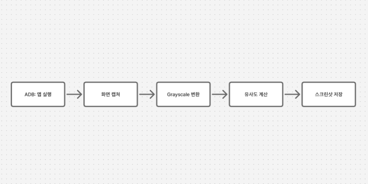

QA 업무 중, 앱 실행 후 특정 UI를 캡처해야 하는 작업이 있었습니다. 한두 개라면 금방 끝나는 일이죠. 하지만 테스트 대상이 100개가 넘는 다면...?

앱 하나당 2분씩만 잡아도 몇 시간이 순식간에 지나가죠. 단순 반복 작업때문에 하루를 소비한다는건 정말 끔찍한 일이죠.

## 내일 당장 쓸 수 있는 도구를 만들자

아이디어는 단순했습니다. '앱을 실행하고 이미지 비교해서 이 UI가 보여주는지 검증하자.'
문제는 웹 개발만 해왔던 터라 모바일도 이미지 처리는 낯선 영역이었습니다.`

그래서 GPT와 함께 검증 & 구체화하고, Cursor 에이전트에서 코드를 함께 다듬는 방식으로 구현했습니다. 문서를 읽을 시간은 없었지만, AI와 대화하듯 코드를 작성해 30분만에 '돌아가는 형태'를 만들 수 있었습니다.



## 5배 효율화하기

완벽한 코드를 짤 여유는 없었습니다.
대신, **당장 돌릴 수 있는 수준**을 목표로 잡았습니다.

- 타이머, 대기 등 조정이 필요한 값은 환경변수를 통해 주입
- 실패 케이스는 로그로 남기기
- 로그 참고하여 변수 조정 + 셀프 이터레이션

메인 업무를 진행하면서 작업이 종료될때마다 조금씩 변수를 조정하면서 이터레이션을 3번 정도 돌렸습니다. 그 결과, 약 80% 앱에 대해서는 자동으로 스크린샷을 성공하고, 나머지 20%는 수기로 진행해 약 300분 걸릴 작업을 60분 만에 마무리할 수 있었습니다.

## 사용한 기술

전 이런 원리를 알아가는걸 좋아합니다. 그리고 언젠가 이 지식을 써먹을 수 있을 날을 위해 정리해봤습니다.

핵심 기술은 세가지 입니다.

- adb: 안드로이드 기기 조작
- python: 이미지 처리에 용이한 언어
- scikit-image: 화면에 띄어지는지 감지하는 유사도 계산

작동 흐름은 간단합니다. ADB로 앱을 실행하고, 일정 시간마다 화면을 캡쳐합니다. 그리고 이전 프레임과 현재 프레임을 비교해 유사도가 일정 기준 이하로 떨어지면 화면을 캡쳐합니다.

명령어 한 줄이면 ADB로 앱 스킴을 실행할 수 있습니다. 저는 UI조작없이 단순히 앱 실행만 시키면 되는 작업이었어요.

```bash
adb shell am start -a android.intent.action.VIEW -d <scheme>
adb shell screencap -p /sdcard/screen.png
```

유사도 측정은 이미지의 구조 정보만 파악할 수 있도록 RGB 색상 정보는 제외하고 Grayscale로 변환여 비교합니다.

```python
from skimage.metrics import structural_similarity

img1_array = np.array(img1.convert('L')) # Grayscale로 변환
img2_array = np.array(img2.convert('L'))

similarity = structural_similarity(img1_array, img2_array)
```

## 마무리

여러 변수가 있어 완벽한 자동화는 아니었습니다. 하지만 약 80%의 커버리지를 확보하면서 5시간은 소요됐을 일을 딱 한 시간만 수기 작업으로 마무리할 수 있었습니다.

앞으로도 팀 생산성을 높일 수 있는 방법을 찾는 QA 엔지니어가 되겠습니다. 💪
